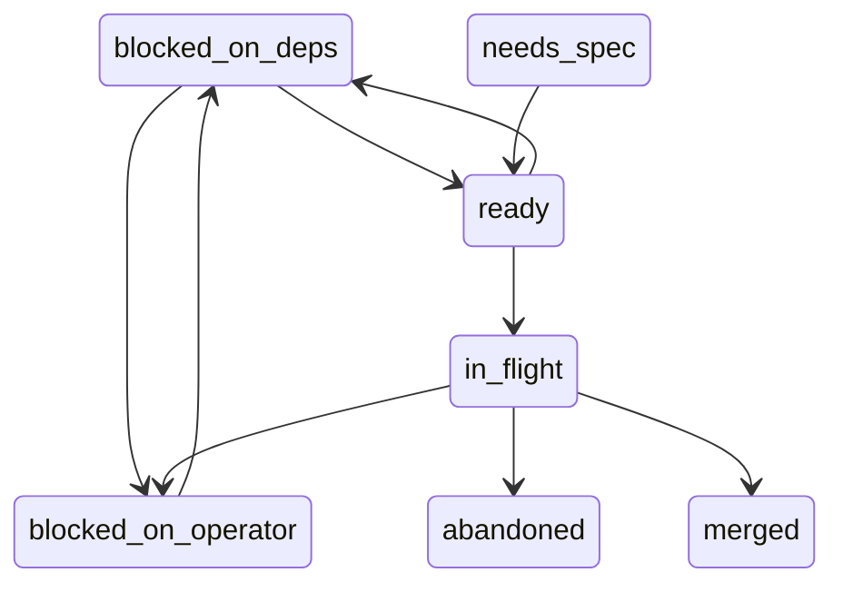
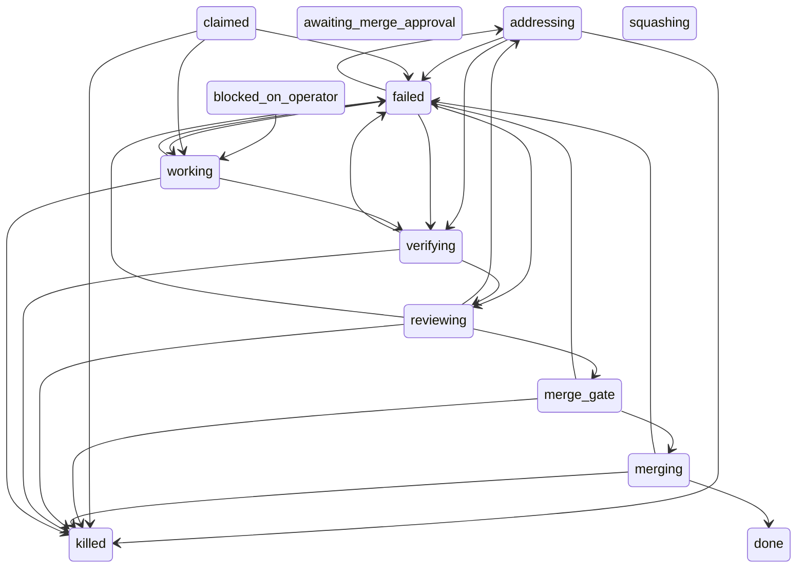

# holo2

A minimal software factory. Two small Python files, no frameworks.

Tickets live in a Linear project; `main` is the only integration point.

Usage: `python3 factory.py /path/to/repo`, or
`python3 factory.py --report /path/to/repo` for the timing table.
`--sweep` reports the runs that have tripped a mechanical condition,
`--sweep --act` fails them, and `--supervise` keeps doing that on a timer
(see [Supervising](#supervising)).

## The loop

1. Claim the first ready ticket — non-terminal and unblocked (Linear
   `blocks` relations are the only machine-checked dependencies).
2. Cut a per-task branch in a sibling worktree (`<repo>.worktrees/`), so
   the main checkout stays untouched, and run the target's configured
   `[worktree] setup` commands there — a worktree that borrows the main
   checkout's environment tests something other than the branch it is on.
3. Implementer agent (Claude Code / Opus at high effort, write access)
   implements and commits under a wall-clock budget from the ticket's estimate
   (default 20 min).
4. Verify gate: the ticket's mechanical verify command must pass before
   each review round and again before merge. A failure is fail-loud: a
   top-level `&&` chain is run clause by clause in one shell, and the report
   names the clause that failed and its exit status, shows the output of
   every clause that ran, and names the clauses the failure short-circuited
   — silence is reported as silence, never as a bare non-zero exit.
5. Local reviewer agent (Codex / GPT-5.6 Sol at medium effort) reviews the
   diff against the task inside the hardened container boundary described
   below;
   findings go back to the implementer for one fix round. Max 2 review
   rounds.
6. Merge gate: the verify command passes again, and the ticket is re-read
   from Linear and held against the snapshot the claim froze (title,
   acceptance criteria, verify commands). A body edited while the run was
   working refuses the merge and preserves the branch — the candidate answers
   the ticket as it was claimed, not as it now reads. A ticket that cannot be
   re-read (Linear down, issue gone) is *not* read as drift: the run records
   that the check had no evidence and the merge goes ahead on the frozen
   contract. On a clean gate: `--no-ff` merge to `main`, worktree and branch
   cleaned up, ticket → Done.
7. On failure (budget blown, no commits, verify stuck, 2 failed rounds):
   the loop stops and leaves the branch + worktree behind for a human;
   the ticket stays In Progress. A no-commit task is discarded outright —
   there is nothing to preserve.
8. On the *second* failed run of the same ticket (`MAX_FAILED_RUNS`), the
   ticket is blocked instead of left open: its stored status becomes
   `blocked_on_operator` and one Linear comment lists what each failed run
   ended on. The claim path re-reads that count before every claim, so the
   ticket is refused even when the board has been dragged back to Todo —
   unblocking is a human's move, not the loop's. Failures are counted since
   the last *recorded* human intervention on the ticket's runs
   (`store.record_intervention()` / `store.resume()`): a recorded human
   touch buys a fresh `MAX_FAILED_RUNS`, while a bare board drag records
   nothing and forgives nothing. A refused ticket is skipped and the next
   one is claimed: a blocked ticket still projects to Todo and still sorts
   where it sorts, so stopping on it would starve every ticket behind it.

## State machines

Both diagrams below are generated from the code, not drawn: `store.py`'s
`TICKET_TRANSITIONS` and `RUN_PHASE_TRANSITIONS` are the only authority for
which moves are legal, `store.render_state_graph()` renders them, and
`tests/test_store_status_graph.py` fails whenever the text between the
markers differs from what the tables render to. Regenerate with
`python3 store.py --state-graph` and paste the output over the marked
sections.

Ticket status (`store.transition()` refuses every edge not drawn here):

<!-- state-graph: tickets -->

<!-- end state-graph: tickets -->
Run phase (the edges the loop writes; `awaiting_merge_approval` and
`squashing` are declared but never entered by this loop):

<!-- state-graph: runs -->

<!-- end state-graph: runs -->

## Files

- `factory.py` — the loop, and `--report`: a read-only query over the store
  printing estimate vs actual per finished run (actual, estimate, ratio,
  rounds, outcome) with mean and median ratio. Each run row carries the
  estimate it was claimed under and the round count stamped at close-out, so
  the report and FINDINGS.md read the same numbers. `--report` claims no
  ticket, cuts no worktree and calls no one.
- `review_runner.py` — exact-SHA staging and the model-neutral local reviewer
  boundary.
- `docker/reviewer.Dockerfile` — pinned minimal reviewer image.
- `linear_provider.py` — Linear GraphQL client: claim/fetch_task/set_state/
  comment,
  ready-ticket and blocker resolution. Ticket status lives in the store and is
  projected onto a Linear workflow state by `factory.mirror_push()` — one way,
  last write wins, never read back — so `set_state` is the only writer of that
  state, and the mapping table beside `mirror_push` says which state each
  status shows as. The direction holds when the board is stale too: a ticket
  whose stored status will not enter `in_flight` is refused at the claim and
  re-projected instead of worked a second time.
- `ticketTemplate.md` — ticket shape. Verify commands go in the
  "Verify command(s)" section (exit 0 = pass, relative paths only);
  estimate is the budget in minutes. The optional "Contract checks" section
  declares `relative/path: exact literal` lines the gate asserts verbatim, so
  a required value (a port, a URL) cannot drift while the commands still pass.
- `ticket_template.py` — parser/validator for that shape;
  `python3 ticket_template.py TICKET.md [...]` exits 0 iff the ticket is
  pickable-ready.
- `tests/test_ticket_template.py` — stdlib unittest suite for it
  (`python3 -m unittest discover tests`).
- `FINDINGS.md` (generated) — a rendered window over the store, not a log:
  the factory regenerates it at each close-out from `runs`/`reviewRounds` as
  the newest 25 entries below a `<!-- store-rendered below -->` marker, with
  everything older counted in one archive line and kept in `holophyte.db`.
  Text above the marker is frozen pre-store history and is never rewritten;
  Linear ticket comments stay the full per-ticket archive.

## Supervising

The loop watches itself only while it is alive. A crashed or hung run leaves
a row in a work phase and a lease nobody gives back, and the supervisor is
what notices: an acting sweep (`--sweep --act`) that fails any run with a
dead heartbeat, a blown time box or a stuck review, releases its leases and
leaves its branch and worktree for a human. `--supervise` runs that sweep
every 60 seconds by default (`[supervisor] sweep_interval_sec`) as a
long-lived process:

```
python3 factory.py --supervise /path/to/repo
```

It runs until SIGINT or SIGTERM, finishing the pass in hand and exiting
clean. One supervisor per target: the first takes
`supervisor.lock` in the target's state directory (beside the store) with an
exclusive create and writes its pid into it; a second `--supervise` for the
same target exits non-zero naming that pid. A lock whose pid is dead is a
supervisor that was killed without the chance to clean up, and is reclaimed
on the next start; reclaims take turns under an flock on the sidecar
`supervisor.lock.reclaim` beside it, which is left in place. A lock
that names no pid at all is not guessed about: the start refuses and says
which file to look at.

Each pass bumps the process's row in the store's `supervisorHeartbeats`
table, so whether the watcher is still watching is a query rather than a
`ps`. The sweep also watches the loop's own restarts: a loop that merges a
change to the factory itself writes a `loopRestarts` row and re-executes,
and if no claim, heartbeat or "no ready tickets" exit follows within
`restart_grace_sec` the next sweep prints `loop did not return after re-exec
from <sha>` and records it, once per restart. Nothing is relaunched. Process management (systemd, a tmux pane, `nohup`) is the operator's;
the factory ships the invocation and nothing around it.

## Serving

`--serve HOST:PORT` runs a read-only HTTP daemon for one target, so a drawer
or dashboard on another host of the tailnet can poll the factory without
ssh:

```
python3 factory.py --serve 100.64.0.1:8787 /path/to/repo
```

It answers two paths as JSON, every response `Cache-Control: no-store`, and
opens the store through a read-only connection per request; it never holds
a connection between requests and never writes. Any other path is 404 and
any method but GET is 405, both as JSON.

| Path | Body |
| --- | --- |
| `GET /status` | `target`, `host`, `now`, `supervisor` (`state` live/stale/none, `pid`, `heartbeat_age_ms`, `host`), `thresholds` (`heartbeat_stale_ms`, `strikes`), and `runs`: one `{id, ticket, phase, heartbeat_age_ms, elapsed_ms, time_box_ms, host}` per live run. 503 when the target has no store yet. |
| `GET /runs?limit=N` | The `--report` table: `rows` of `{ticket, actual_min, estimate_min, ratio, rounds, outcome, host}`, the same rows in the same order as `--report` prints, oldest first; `?limit=N` keeps the first N and echoes `limit` (null when absent). A `limit` that is not a positive integer is 400 with an `error`. |

Every `host` passes through `[report] host_label`, so a configured label is
what the network sees rather than the machine name.

The boundary is the bind address and nothing else. The daemon has
**no authentication**: it binds to the one address the command line names
and anyone who can reach that port can read run and ticket identifiers,
phases, heartbeat ages and the estimate-vs-actual history. Bind it to the
tailnet address only. Binding to `0.0.0.0` publishes that history to every network
the host is on, and there is no flag, token or allow-list in the factory
that would narrow it back; the tailnet's membership is the whole access
control, by design.

## Linting

`ruff check .` from the repo root; it exits 0 when the tree is clean. Run it
alongside the tests — the developer verify path is:

```
ruff check .
python3 -m unittest discover -s tests
```

The configuration lives in `pyproject.toml` under `[tool.ruff]`: line length
88, target `py311`, and rule sets `E`, `F`, `W`, `I` (pycodestyle errors and
warnings, pyflakes, import ordering). Nothing is formatted, only checked.
Every enabled rule is a promise the factory keeps forever, so the selection
stays small, and a violation that has to stand is suppressed with a per-line
`# noqa: <CODE>` rather than a file-level or blanket ignore.

ruff is a developer tool, not a dependency: install it on the host with
`pip install --user ruff` (or `uv tool install ruff`). It is never vendored.

## Config

`LINEAR_API_KEY` — an env var or `.env` next to `linear_provider.py`. Which
Linear project a target is driven from is the `[board]` table of that
target's `config.toml`, below.

Per-target behavior lives in `~/.holophyte/<slug>/config.toml`. Everything the
factory keeps about a target sits in that one directory — the store at
`store.db`, the supervisor lock — created on first need; only
`<repo>.worktrees` keeps a sibling address of its own.

The directory is host state, not repo state: it holds this host's agent
routes, leases and heartbeats, so it belongs to the host rather than to a
checkout that gets cloned, moved and deleted. `<slug>` is the target's
basename plus the first eight hex digits of the SHA-1 of its absolute path,
so `/a/repo` and `/b/repo` — two repositories with two histories — never
share a store. Set `HOLOPHYTE_HOME` to put the whole tree somewhere other
than `~/.holophyte`; the tests use it, and nothing else reads a home path.

Older layouts are adopted once, on the first retarget that finds them: a
`<repo>.holophyte/` directory beside the checkout, or the dotted siblings
that preceded it (`<repo>.holophyte.db` with its `-wal`/`-shm` sidecars and
`<repo>.holophyte.toml`), are moved into the state directory with one
`[holo2] adopted <from> -> <to>` line per file. What ends adoption is the
store at the new address, not the directory holding it, so writing
`config.toml` there by hand first does not strand a legacy history — the move
merges into the directory that is already there. If a store is already at the
new address and another is still at an old one, the factory exits non-zero
naming both and moves nothing: which history is the real one is an operator's
decision, not a guess. A single file already sitting at a landing address —
that hand-written `config.toml`, say, with a legacy `<repo>.holophyte.toml`
still beside the checkout — stops the move the same way rather than being
overwritten.

Adoption runs for the target the command line names, once `cli()` has named
it. Importing the module or asking for `--help` derives paths and moves
nothing.

The file is optional:
absent means every default below stays in place, which is how the factory runs
against itself. A file that exists but does not parse is a startup error naming
the file and the line — a config the operator wrote is never silently ignored.
Tables this version does not know are left alone. Inside a table it does read
(`[agents]`, `[worktree]`, `[supervisor]`, `[loop]`, `[report]`, `[board]`), a key it does
not read is
a startup
error naming the file, the table, the key and the keys the table accepts:
`setup_timeout_min` is a typo, not a timeout, and a typo the factory ignored
would leave a knob believed set that is not. The accepted keys are listed with
each table below.

```toml
[agents]
# Each role's harness command. The task goal is appended as the last argument,
# so end the command where its prompt goes (`-p` for Claude Code, nothing for
# `codex exec`). Omit a role to keep its default.
implementer = "claude --model opus --effort high -p"   # default route
reviewer    = "my-reviewer --diff"                     # see the caveat below
adjudicator = "my-reviewer --final"
```

Accepted keys: `implementer`, `reviewer`, `adjudicator`.

Defaults, in place whenever the key is absent: `claude -p <goal> --model opus
--effort high` implements; `review` and `adjudicate` go through the hardened
container described below. **A `reviewer` or `adjudicator` override is also an
opt-out of that container** — the configured command runs directly in the task
worktree. Overriding the implementer has no such effect; it already runs there.

What an override keeps is the pair the round is about. Before the command runs,
the task worktree's `refs/review/base` and `refs/review/candidate` are pointed
at the round's two commits — the same names the staged checkout uses, and the
names the reviewer prompt tells the command to read. Both must be full commit
SHAs the worktree has, with the base an ancestor of the candidate, or the round
is refused rather than run against whatever `HEAD` happens to be.

Every configured command is resolved at startup, before the run claims a
ticket: the string has to split to an argv, and its program has to be an
executable found on `PATH` or named by an absolute path. A name that resolves
nowhere is an error while nothing is in flight, rather than a
`FileNotFoundError` in the middle of a round holding the project's run lease.
Startup does not *run* the command — a route is an agent turn, not a probe.
Relative paths with a directory in them (`./review.sh`) are refused: rounds run
in a task worktree that does not exist yet, so the name would resolve somewhere
neither startup nor the operator named.

```toml
[worktree]
# Shell commands that prepare a freshly cut task worktree, run in order.
setup = [
  "python3 -m venv .venv",
  ".venv/bin/pip install -q -e '.[dev]'",
]
# Wall-clock cap per setup command, in seconds. Optional; the default is the
# verify gate's 300-second cap.
setup_timeout_sec = 300
```

Accepted keys: `setup`, `setup_timeout_sec`.

They run in the worktree, right after its branch is cut and before the first
agent turn — the moment that decides what the implementer and the verify gate
have to work with. Without them a worktree silently borrows the main checkout's
environment (its `.venv`, its module cache), so a task that changes a dependency
is tested against the old one. Each command goes through the same machinery as a
ticket's verify command: shell, one command per entry, a per-command cap
(`setup_timeout_sec`, a positive number of seconds; 300 when absent), and a
fail-loud report that names the failing command, the cap when it is the cap
that fired, and its output, attributing a top-level `&&` chain clause by
clause.

A failing command stops the setup — step two of a setup assumes step one worked
— and fails the run before an agent turn is dispatched, so a target whose
toolchain will not install costs no tokens. The branch and worktree are
discarded rather than preserved: no agent ran, so there is nothing on them to
keep, and the reason goes to the ticket as a comment. The table's shape is
checked at startup with the `[agents]` commands; the commands themselves are not
run there, since the worktree they are written against does not exist yet.

What setup writes into the worktree is untracked, and the implementer is asked
to commit its work: keep build artifacts (`.venv/`, caches) in the target's
`.gitignore`, or a task's `git add -A` will sweep them into the branch.

```toml
[supervisor]
# The sweep's thresholds. Every key is optional; the values shown are the
# defaults, in place whenever the key (or the whole table) is absent.
heartbeat_stale_min      = 5    # a heartbeat older than this is a silent sighting
stale_strikes            = 2    # consecutive silent sightings that trip a run
budget_grace             = 1.5  # multiple of the ticket's estimate that blows the box
review_overlap_threshold = 0.5  # findings shared by two rounds that reads as stuck
sweep_interval_sec       = 60   # sleep between two --supervise passes
restart_grace_sec        = 120  # how long a self-merge re-exec may take to come back
```

Accepted keys: the six above.

Different targets want different patience — a Go build's worktree setup is
slower than stdlib Python's — and these are the knobs `--sweep` and
`--supervise` read. Each value is checked at startup, for every mode: the
thresholds and the interval must be positive numbers, `stale_strikes` a
positive integer, and the overlap a fraction in (0, 1]. A value outside its
constraint is an error naming the key and the constraint, like malformed TOML,
rather than a default quietly used in its place. A key this version does not
know is refused the same way. The config is read once at startup; a running
supervisor does not pick up an edit.

```toml
[loop]
# What the claim loop does after a run it closed out as failed. Optional; the
# value shown is the default.
stop_on_failure = true   # false: record the failure and claim the next ticket
```

Accepted keys: `stop_on_failure`.

By default one failed run ends the process after its close-out, with a nonzero
exit, and an operator relaunches the loop — the right call while the loop is
still being watched. With `stop_on_failure = false` the run is closed out
exactly as before (released, escalated if it was one failure too many, the
`FINDINGS.md` window regenerated) and the loop goes on to the next ready ticket
in the same process, for an unattended night. Escalation is untouched: a ticket
that fails twice still parks itself for a human; the knob only decides whether
one failure stops the whole queue. The exit status is still nonzero once the
queue is empty if any run failed. The value must be a boolean, `true` or
`false`; a string such as `"yes"` is a startup error naming the key, like a
`[supervisor]` threshold outside its constraint.

```toml
[board]
# The Linear project this target claims from and the team whose workflow
# states its tickets move through. Required for the loop and --supervise.
project_id = "00000000-0000-0000-0000-000000000000"
team = "Example Team"
```

Accepted keys: `project_id`, `team`.

The board is a per-target setting: two targets on one host driven from one
process-wide variable would both claim from the same project, and the second
would silently work the first's queue. Both values must be non-empty strings.
`--report`, `--serve` and a read-only `--sweep` need no board and run without
the table; the loop and `--supervise` exit at startup naming `[board]
project_id` when it is absent. For one release, `HOLO2_PROJECT_ID` and
`HOLO2_TEAM` in the environment (or the factory's own `.env`) stand in for an
absent table, and the factory prints `[board] table absent; using
HOLO2_PROJECT_ID and HOLO2_TEAM from the environment` once so the setting can
be moved; a later release removes that fallback.

```toml
[report]
# What the factory prints where it would print the writer host's hostname.
# Optional; absent, the hostname is printed as recorded.
host_label = "writer-1"
```

Accepted keys: `host_label`.

The `host` column of `--report` and `--sweep` and the supervisor's startup
and refusal lines show the label in place of the hostname when it is set.
The `FINDINGS.md` window the loop commits renders no host: its run and round
entries never carried one, so there is nothing there to relabel. The column
of the report and sweep exists so a reader
can tell which writer produced a run when there is more than one; a stable
label does that job without naming a personal machine in a public repository.
The store keeps recording the real hostname (`runs.host`,
`supervisorHeartbeats.host`, the lock file), which the supervisor compares
against its own, so the label can be renamed later without a migration. The
value must be a non-empty string; anything else is a startup error naming the
key.

## Local reviewer boundary

The factory never gives a reviewer the implementation worktree directly.
`review_runner.py` stages the frozen base and candidate commits into a fresh,
detached, zero-remote Git repository and verifies its identity before and after
the review. Docker mounts that repository at `/workspace` read-only. The
container also has a read-only root filesystem, no Linux capabilities, no
privilege escalation, bounded processes/memory/CPU, and no Docker socket or
host home.

Codex runs with `danger-full-access` **inside** this container because Ubuntu's
AppArmor policy blocks its nested Bubblewrap sandbox in the Hermes service
context. The outer container is the enforcement boundary: an actual write
probe under `/workspace` must fail before the model is called. Only a
disposable copy of `~/.codex/auth.json` and the installed Codex release binaries
are mounted; the copy and all reviewer state are removed afterward. Outbound
network remains enabled because Codex uses remote inference, but no GitHub,
SSH, Linear, Docker, or unrelated host credentials are exposed.

The first review builds `holophyte-reviewer:ubuntu24.04-v1` automatically from
the digest-pinned Ubuntu image. A run fails closed if preflight identity or
write rejection fails, the Codex tool host cannot execute a local command, the
container times out, or the staged repository fingerprint changes.
