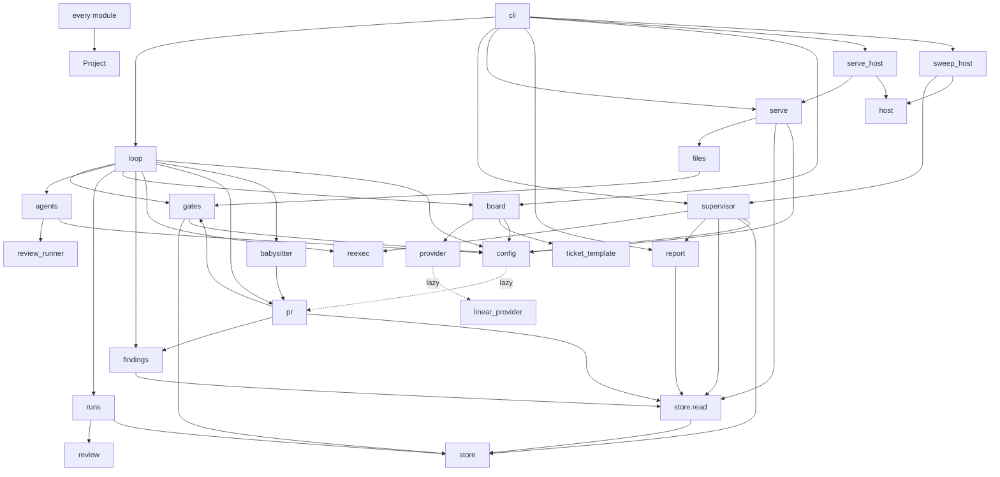

# Seams and modules

The package split (phase 2, 2026-09-02) turned one 3,300-line file into
modules with named seams. The seams are the point: each is a place where a
later implementation, a test double, or a port in another language can
stand in without the rest noticing. [Development](../development.md) lists
every file; this page lists what each seam promises.

## The seams

| Seam | Where | Promise |
| --- | --- | --- |
| **`Project`** | `holophyte/project.py` | Everything about where a project's state lives, as a value: repository path, state directory, store path, config path. No module-level globals name a project; a function that needs one takes it. Two projects can exist in one process, which is what the tests, the daemon and a future port need. |
| **`Provider`** | `provider.py` | The board as a protocol: `claim_next`, `fetch_task`, `set_state`, `comment`, `team`. `LinearProvider` lazily imports the GraphQL module; `FileProvider` reads a directory of `<ID>.md` files for tests and offline runs. The loop never names Linear. |
| **`store.read`** | `store/read.py` | Typed, read-only views; the only SQL outside `store/__init__.py`. Every consumer that renders state (report, sweep, findings, serve) goes through it. |
| **`runs`** | `holophyte/runs.py` | The loop's store seam: `open_store`, `set_phase`, `heartbeat_while`, `record_round`, `warn_on_run`, `review_round_cap`. Six helpers, so a wiring change extends one file instead of threading SQL through the loop. |
| **`gates`** | `holophyte/gates.py` | Worktree cutting and reuse, the verify gate, process-group reaping. Takes a project and a ticket, returns a red or green report. |
| **`agents`** | `holophyte/agents.py` | `agent_route()` (which command, which model, from `[agents]`) and `agent()` (one turn of a role in a process group with a budget). The implementer and the reviewer are both routes; `review_runner` is the reviewer's transport. |
| **`review`** | `holophyte/review.py` | Reviewer prose in, structured findings and a verdict out: the `CRITERION n:` checklist parser, the witness-test resolver, the finding key. |
| **`findings`** | `holophyte/findings.py` | The `FINDINGS.md` window renderer, byte-stable, from `EndedRun` and `ReviewRound` rows only. |
| **`board`** | `holophyte/board.py` | Linear as a notice board: mirror a ticket into the store with its contract snapshot, push status, detect drift at merge, escalate a twice-failed ticket, file and update tickets from files. |
| **`reexec`** | `holophyte/reexec.py` | Replace the process with the same command line, through an `EXEC` seam tests can intercept, shared by the loop and the project daemon; and `systemctl --user` on the deploy units (the loop's, the sweep's), shared by the supervisor and the daemon's actions. |
| **`host`** | `holophyte/host.py` | The host registry, `host.toml`: the projects the host daemon serves and the host sweep watches, by path, re-read when it changes; written by `project add` and `project remove` alone. A route name resolves through `Host.project()` alone. Opens no store. |
| **`config`** | `holophyte/config.py`, `holophyte/config_tables.py` | Every `config.toml` table as a typed value with defaults, validated at startup; unknown keys are startup errors. |

## What depends on what

Arrows point at what a module imports. The three modules the PR merge mode
and the console brought: `pr.py` (the push, the pull request and its merge
API; imports `store.read`, `findings` and `gates`), `babysitter.py` (the
thread verdicts of a PR pass; imports `pr.py`) and `files.py` (touched-file
counts read from git for the daemon; imports `gates`, and is imported by
`serve`). `config` imports `pr.py` lazily, at the startup route check only.
Three rules hold the graph in this shape: `serve` reads through
`store.read`, and its action endpoints (`serve_actions`) write only through
the store API (`store.record_intervention()`, `store.requeue()`,
`store.operator_notes.send_back()`);
`holophyte.config` never imports `factory` or the loop (no cycles); and
nothing outside `store/` writes SQL. The host forms sit on top of the
project ones: `serve_host` is `serve`'s handler under a `/projects/NAME`
prefix, one `Project` per registry entry, and `sweep_host` runs the
supervisor's sweep and reconcile per store, bounded by `deadline`.

## Configuration as the second seam

Everything an operator would otherwise patch is a `config.toml` table on
the project, read at startup and refused if unknown:

| Table | Chooses |
| --- | --- |
| `[agents]` | the implementer, reviewer and adjudicator commands |
| `[worktree]` | setup commands run in each fresh worktree and their cap |
| `[supervisor]` | stale threshold, strikes, time-box grace, review-overlap threshold, sweep interval, restart grace |
| `[loop]` | stop on failure; claim order by identifier or priority; `spawn_supervisor`; the review-round cap from `review_rounds`, `review_rounds_per_lines` and `review_rounds_max`; `workers`, the pool's ceiling |
| `[board]` | the Linear project, or board, and team this project claims from |
| `[report]` | the host label rendered instead of the machine name |
| `[merge]` | `approve` (auto or human), `mode` (local or pr) and `pr_rounds`, the babysitter-pass cap |
| `[console]` | `daemons`, the `HOST:PORT` peers the console page fans out to |
| `[serve]` | `name`, the route and unit name; `token_file`, the bearer token a project daemon reads for a non-loopback bind; the opt-ins |

The host's own file, `host.toml`, is the third: the registry's
`[[project]]` paths, and the host daemon's bind, machine token and
`actions`, the host sweep's `sweep_sec` and the console's `daemons`
([The host registry](../operating.md#the-host-registry)).

[Config](../config.md) has each with a commented example.

## What a port would replace

The store schema and the ticket template are the cross-language contracts.
A Rust daemon replaces `serve.py` against the same store; a Rust verify
gate replaces `gates.py` with the same clause-by-clause report; the Python
test suite run against the other binary is the acceptance oracle. That
ordering is the roadmap's, and it is why the seams came first.
