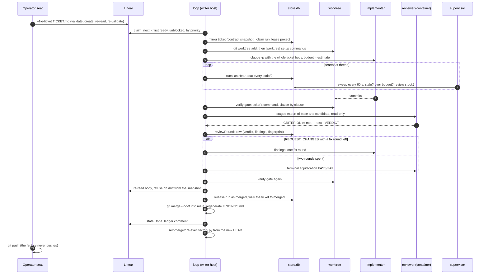

# Lifecycle of a ticket

One ticket, from a markdown file on the operator's machine to a commit on
`main`, with the module, the table and the process that owns each step.
The numbers match the [loop](../loop.md) description; this page adds where
each step leaves its trace.

## Step by step

### 0. Filing

The operator writes `TICKET.md` in the
[template](../operating/tickets.md), validates it with
`ticket_template.py FILE --repo TARGET`, and files it with
`factory.py TARGET --file-ticket FILE --priority high`. The command
validates again, creates the issue in the target's `[board]` project,
reads the stored body back and validates that, so a transfer that rewrote
the body is caught before the loop ever sees it. Edits go the same way with
`--update KO-n`.

Trace: nothing in the store yet; the issue in Linear, in Todo.

### 1. Claim

`linear_provider.claim_next()` lists the project's non-terminal, unblocked
issues (Linear `blocks` relations are the only machine-checked
dependencies), orders them by `[loop] order` (identifier or priority), and
returns the first the store will accept. `board.mirror_task()` upserts the
ticket row with a **contract snapshot**: title, criteria, verify commands,
estimate. `body_problem()` runs the validator against the live body with
the target repository; a body that fails is mirrored as `needs_spec` and
skipped. `store.claim()` opens the run row and takes the project lease in
one `BEGIN IMMEDIATE`.

Trace: `tickets` (status `in_flight`, `activeRunId`), `runs` (phase
`claimed`), `projects.activeRunId`, a `runEvents` row, Linear state In
Progress.

### 2. Worktree

`gates.cut_worktree()` adds `<repo>.worktrees/<branch>` detached from
`main` and checks out `task/ko-n-slug`. If a preserved branch from an
earlier failed run exists, the loop reuses it and merges the moved-on
`main` into it; a conflict is a clean refusal for a human. `[worktree]
setup` commands run there under their own cap, so the branch is tested
with its own environment and never the main checkout's.

Trace: `runs.branch`, phase `working`.

### 3. Implementer

`agents.agent()` runs the configured implementer command (`claude -p
--model fable --effort medium` on the writer host) in its own process
group with the whole ticket body as the prompt and a wall-clock budget from
the estimate. `runs.heartbeat_while()` beats `runs.lastHeartbeat` on a
daemon thread at half the supervisor's stale threshold for as long as the
agent runs; without it a long implementation read as a dead loop. Over
budget, the whole process group is killed.

Trace: heartbeats; commits on the branch.

### 4. Verify gate

`gates.run_verify()` runs the ticket's verify command in the worktree. A
top-level `&&` chain is run clause by clause in one shell; the report names
the failing clause and its exit status, shows every clause's output, and
names the clauses the failure short-circuited. Zero tests discovered is
red, not green. The gate runs before every review round and again before
the merge.

Trace: the report text travels into the review prompt and the round row.

### 5. Review

`review_runner.stage_candidate()` exports the base and candidate commits
into a fresh, detached, zero-remote repository, fingerprints it, and
`docker run`s the reviewer image with that repository mounted read-only.
Inside, Codex is asked to account for every acceptance criterion with one
line each (`CRITERION n: met — tests/file.py::Class::test`, `not met`, or
`unwitnessed`) and end with a verdict. `review.parse_findings()` turns the
reply into structured findings keyed by `(path, line, severity)`;
`review.criteria_findings()` resolves each named witness test against the
worktree and treats a missing one as unwitnessed. Any criterion not met or
unwitnessed makes the round `changes_requested` regardless of the verdict
line.

Trace: a `reviewRounds` row per round with the verdict, the findings, their
fingerprint, and the verify result the reviewer saw.

### 6. Fix rounds and adjudication

`REQUEST_CHANGES` sends the findings back to the implementer for one fix
round, then a second review. After two rounds a terminal adjudicator
answers PASS or FAIL. Meanwhile the supervisor's `review_stuck` check
compares the two rounds' finding sets; a Jaccard overlap at or above the
threshold with the same complaints twice ends the run, because the review
is circling rather than converging.

Trace: rounds 1, 2 and the adjudication as `reviewRounds` rows; phases
`reviewing`, `addressing`, `verifying`.

### 7. Merge gate

The verify command runs once more. `board.merge_drift()` re-reads the
ticket from Linear and compares it with the snapshot from step 1; a body
edited while the run worked refuses the merge and preserves the branch. A
board that cannot be read is recorded as "no evidence" and the merge
proceeds on the frozen contract. Then `git merge --no-ff` into `main`, the
worktree and branch are removed, `store.release()` ends the run as
`merged` and walks the ticket to `merged`, `findings.render()` rewrites the
`FINDINGS.md` window, and the provider pushes Done and a ledger comment.

Trace: `runs.outcome = merged`, `tickets.status = merged`, a merge commit
whose message names the ticket, a fresh `FINDINGS.md`.

### 8. After the merge

If the target is the factory itself, `reexec.reexec_self()` replaces the
loop process with a fresh `factory.py` from the merged code and records a
`loopRestarts` row; the supervisor notices the checkout's HEAD moved on its
next pass and re-execs too. The daemon does not; it is stateless and the
operator restarts its unit. The operator pushes `main` to origin by hand.

## When it goes wrong

| Failure | Who notices | What happens | Operator step |
| --- | --- | --- | --- |
| Budget blown, no commits | loop | run `failed`, branch discarded (nothing to keep) | none, or requeue after a contract fix |
| Verify red before merge, two failed rounds, adjudication FAIL | loop | run `failed`, branch and worktree preserved | read the ledger; `--requeue KO-n --note …` after fixing the contract |
| Heartbeat stale, time box blown, review stuck | supervisor | run swept `failed`, leases released, branch preserved; the loop stops itself on the ended run | `--requeue`, relaunch the loop |
| Ticket body edited mid-run | merge gate | merge refused, branch preserved | restore the body or work it again |
| Second failed run of the same ticket | claim path | ticket `blocked_on_operator` with a Linear comment listing both failures | a recorded intervention buys another attempt |
| Codex backend down | loop | run `failed` on the reviewer route | wait, `--requeue` |
| Loop dies mid-review | supervisor + signal handler | the review container is removed on SIGTERM; `--sweep` lists strays | `--sweep --act` |

Each row was a real day. The [runbook](../operating/runbook.md) has the
commands.
