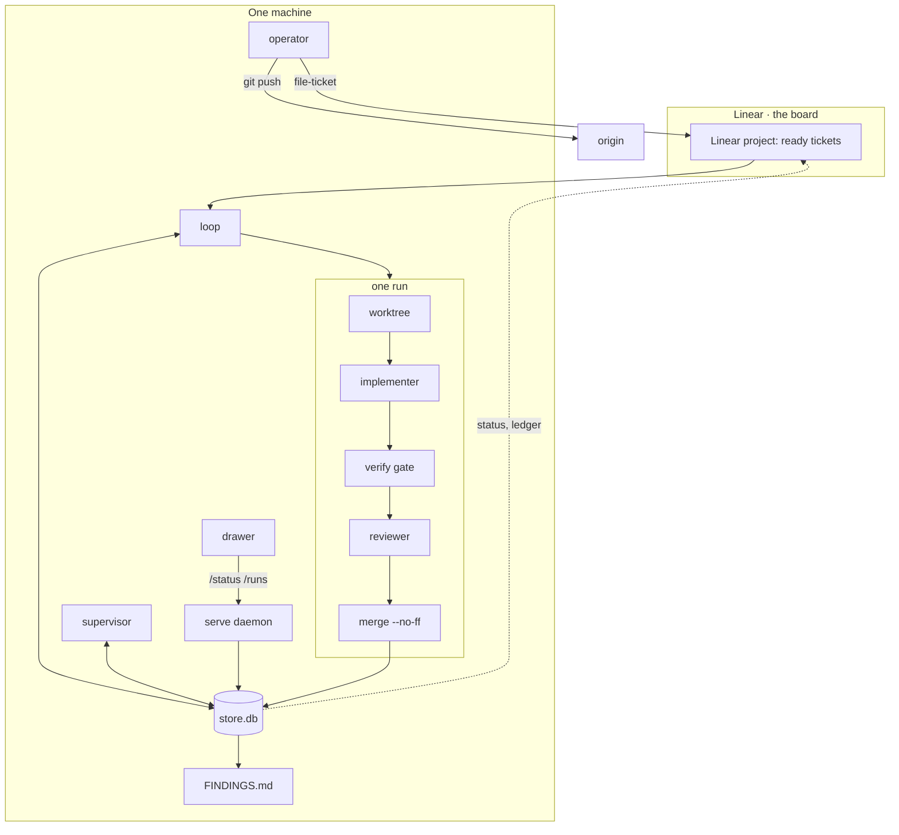

# How it links together

Everything in Holophyte is one of four kinds of thing: a **process** that
does work, a **store** that remembers it, a **boundary** that other code is
kept behind, or a **projection** rendered from the store for someone to
read. The store is the only thing every other part agrees on.

Solid arrows carry work. Dotted arrows are projections: the store is
written by the loop, the supervisor and the serve daemon's action
endpoints, all through the store API, and Linear, `FINDINGS.md`, the
daemon's JSON and the drawer are all views of it. Everything in the box
runs on one machine; splitting the drawer or the operator onto a second
one is [Across machines](../operating/hosts.md).

## The four kinds, named

### Processes

| Process | Started by | Reads | Writes | Ends when |
| --- | --- | --- | --- | --- |
| **loop** (`factory.py PROJECT`) | operator, in a terminal | Linear, store, config | store, worktrees, `main`, Linear, `FINDINGS.md` | queue empty, a failed run, or after a self-merge (re-execs) |
| **supervisor** (`--supervise --once`, the host sweep) | a systemd timer every 60 s, for every registered project; for an unregistered one, the loop or the operator (`PROJECT --supervise`) | stores, the host registry, Linear, GitHub | stores (strikes, releases, heartbeats), `sweep.json` | after one run; the project form on SIGTERM |
| **serve daemon** (`--serve`) | a systemd socket on the first connection, one per host; or the operator, per project | stores, read-only | stores and units through its two opt-ins | when the factory checkout's HEAD moves: the next request starts the new code |
| **implementer** | the loop, per run | the worktree, the ticket body | the worktree | budget or commit |
| **reviewer** | the loop, per round | a staged, read-only export of the candidate | its verdict text | verdict or timeout |
| **drawer** | SwiftBar, every 10 s | the daemons | nothing | never |

[Processes](processes.md) describes each in detail, including how they
restart.

### The store

One SQLite file per project, WAL mode, eleven tables: projects, tickets,
runs, review rounds, run events, sweep strikes, supervisor heartbeats, loop
restarts, Linear deliveries, ledger, interventions. Two state machines live
in it
as data (`TICKET_TRANSITIONS`, `RUN_PHASE_TRANSITIONS`) and every
transition goes through one function that refuses edges not in the table.
Typed read views in `store/read.py` are the only SQL the rest of the code
sees. [Store and state](data.md) has the tables and the diagrams.

### Boundaries

- **The ticket body** is frozen at claim time. The merge gate re-reads it
  and refuses to merge if it drifted.
- **The worktree** is where the implementer works; the main checkout is
  never touched until the merge gate passes.
- **The verify gate** is the ticket's own command, run clause by clause,
  before every review and again before the merge.
- **The review container** sees a clean export of the candidate commit,
  read-only, with no credentials and no host home. It can witness only
  what is in that tree. See [Reviewing](../reviewing.md).
- **The bind address and the bearer token** are the daemon's access
  control: it listens on `127.0.0.1`, or on one private-network address,
  and nowhere else; a non-loopback bind refuses to start without a token
  file (the host registry's `[serve] machine_token_file`, or a project
  daemon's `[serve] token_file`), and every JSON route but `/peers` then
  demands that bearer token.
- **The host registry** is the daemon's only map from a route name to a
  project: `/projects/NAME` resolves through it, never through a path built
  from the URL, and a name outside it is 404 before any file is opened.

### Projections

- **Linear state** is pushed from the store, one way, last write wins,
  never read back for status. The ticket body is read back, once, at
  claim and again at merge.
- **`FINDINGS.md`**, in a project that opts in with `[report] findings =
  "repo"`, is the newest twenty-five entries below a marker, regenerated
  from `runs` and `reviewRounds` at every close-out. Nobody edits it. By
  default (`"none"`) it is not rendered: the store is the record.
- **The JSON routes** in [HTTP endpoints](../reference/http.md)
  (`/status`, `/runs`, `/ledger`, `/attention` and the rest) are each
  store as JSON under its project's `/projects/NAME` prefix, one read-only
  connection per request; the host daemon's root `/status` and
  `/attention` gather every project's.
- **The drawer** is those endpoints as a menu.

## What talks to what, and over which channel

| From | To | Channel | Direction |
| --- | --- | --- | --- |
| loop | Linear | HTTPS GraphQL, `LINEAR_API_KEY` | outbound |
| loop | implementer | subprocess in its own process group | local |
| loop | reviewer | `docker run`, staged repo mounted read-only; Codex reaches its backend outbound from inside | local + outbound |
| loop | origin | nothing. The factory never pushes; the operator does | none |
| supervisor | loop | through the store (strikes, releases, `loopRestarts`), and `systemctl --user start` of the loop's unit when a ticket is ready | local |
| daemon | drawer | HTTP on the bind address | local, or inbound from a private network |
| operator | Linear | `--file-ticket` against the project's `[board]` | outbound |

## Why it is shaped this way

Every gate is the fossil of a failure. The
[roadmap's failure lineage](../roadmap.md#failure-lineage-why-each-gate-exists)
lists the wreck each one bought, from empty verify output to mid-run
goalpost edits. The standing decisions that keep the shape small are on the
same page: no mechanism without a demonstrated consumer, pluggable by shape
rather than by system, tickets as atoms, every failure becomes a mechanical
gate, and the factory never pushes.
