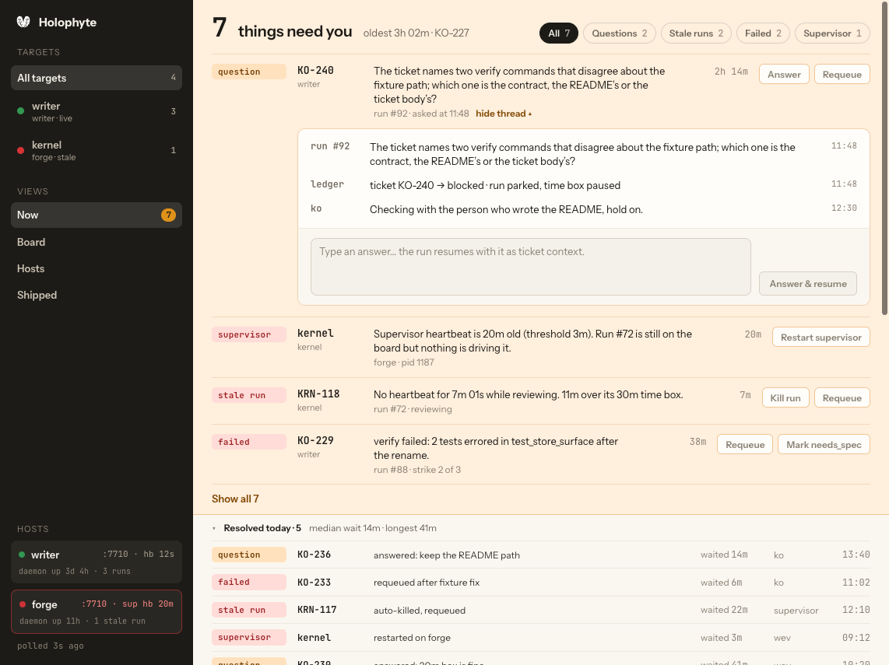
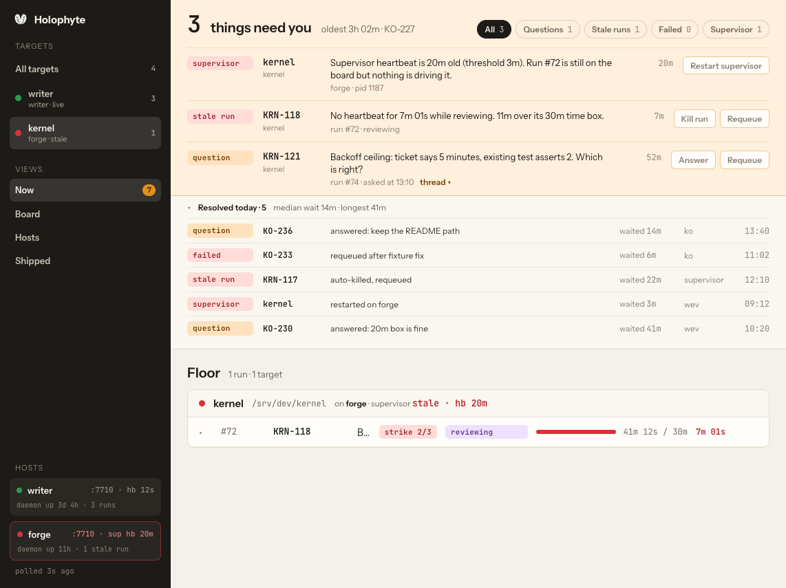
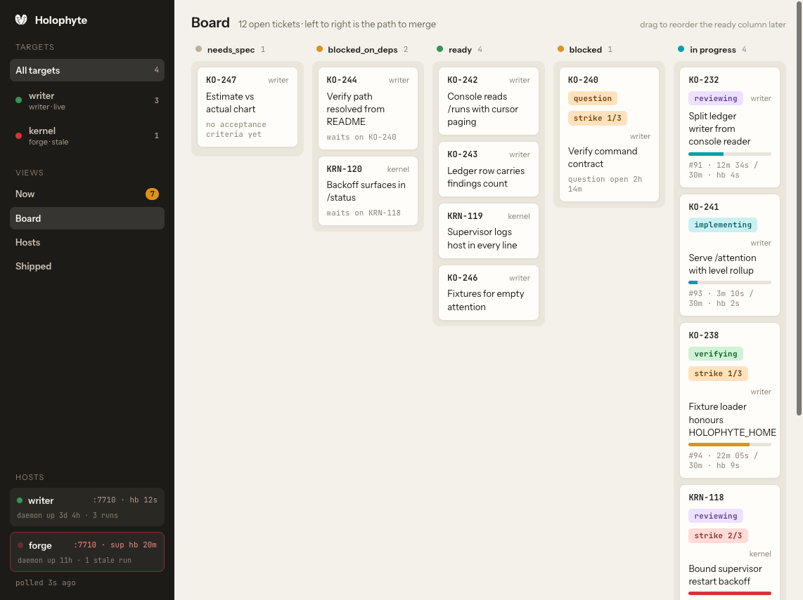
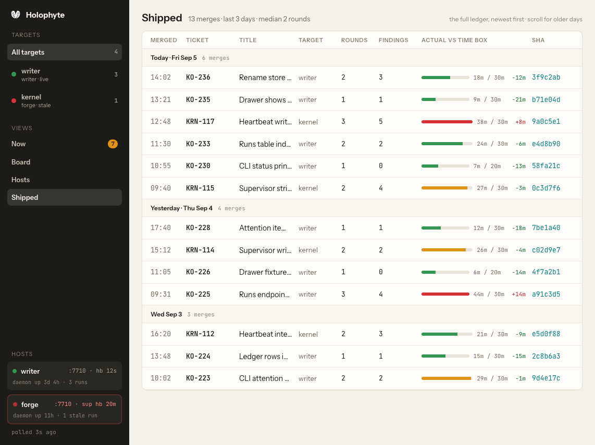

# Console design handoff

*Kept with [note 13](../0013-console.md), which accepts this design as the
console's shape on 2026-09-05. Produced with Claude Design from the daemon's
fixtures. The interactive HTML reference and its runtime stay outside the
repository; the README below is the handoff's own text, unedited. Where it
says Electron, [note 5](../0005-frontend-before-rust.md) as amended applies:
the renderer is a page served by the daemon, Electron is an optional wrapper.
Where it says "target", the console says "project". The hosts screenshot is
omitted because it carries invented addresses.*

---

### Handoff: Holophyte Console (v0)

### Overview
A web console for the Holophyte v2 software factory (repo `wevial/holophyte`). It answers, in order: what needs a human right now, what runs are on the floor and how they're doing, where tickets sit on the path to merge, and whether the hosts/daemons are alive. It reads the existing daemon JSON endpoints (`/status`, `/runs`, `/attention` on `:7710`) and, in v0, performs no writes — operator buttons are rendered but disabled.

Target: a desktop **Electron** app. The design is one screen (`Holophyte Console v0.dc.html`) with a left rail and four views; minimum window width ~1100px. No mobile layout is in scope.

### About the Design Files
The files in this bundle are **design references created in HTML**. They show the intended look and behavior; they are not production code to copy. The job is to **recreate these screens in the target codebase's environment** using its established patterns. Holophyte currently has no web frontend (design note `docs/design/0013-console.md` leaves the shape open), so the Electron renderer can use whatever UI stack the team prefers; keep the daemon's JSON as the only data contract.

### Fidelity
**High-fidelity.** Colors, type, spacing and interaction states are final. Data shown is invented but shaped exactly like the daemon fixtures in `tests/fixtures/drawer/*.json`.

### Screens / Views

#### Shell
- Frame: paper `#f4f1ea` background. Left rail 220px, `#1d1b17`, padding 18px 14px, gap 22px between groups. Main area fills the rest and scrolls vertically.
- Rail contents, top to bottom:
  - Logo (`assets/menubar-template.svg`, 20px, inverted) + "Holophyte" 15px/700.
  - **Targets** group: uppercase 11px label (`#8a8275`, letter-spacing .08em). Items: "All targets" (selected: `rgba(244,241,234,.12)` bg, radius 7px) then one row per target with status dot 9px, name 13px/600, sub-line "host · supervisor state" 11px `#a89f90`, run count mono 11px right-aligned.
  - **Views** group: Now (with amber count badge: `oklch(0.72 0.15 70)` bg, `#1d1b17` text, mono 11px, pill), Board, Hosts, Shipped. Selected style same as targets. Buttons 13px/600, padding 8px, unselected text `#c9c1b3`.
  - **Hosts** footer (margin-top auto): one card per host, `rgba(244,241,234,.06)` bg, radius 8px, padding 10px. Row: dot 8px, name 13px/600, right mono 11px "`:7710 · hb 12s`". Second line mono 10px `#8a8275` "daemon up 3d 4h · 3 runs". A host with a stale supervisor gets a `1px solid oklch(0.58 0.2 25 / .5)` border, a pulsing red dot and red heartbeat text `oklch(0.75 0.14 25)`. Below: "polled 3s ago" mono 11px.

#### Now view (default)
1. **Needs-you band** — `oklch(0.96 0.03 70)` bg, bottom border `oklch(0.85 0.08 70)`, padding 18px 24px 0.
   - Headline row: count in mono 34px/700, "things need you" 20px/600, "oldest 3h 02m · KO-227" 13px `#6e675c`. Right: filter chips (All 7 / Questions 2 / Stale runs 2 / Failed 2 / Supervisor 1): 12px/600, padding 5px 10px, pill; selected `#1d1b17` bg + `#f4f1ea` text; unselected transparent + `1px solid #d8d1c4` + `#6e675c`.
   - Rows: grid `96px 84px 1fr 60px auto`, gap 14px, padding 12px 0, top border `oklch(0.9 0.05 70)`. Cells: kind pill · ticket (mono 13px/600) with target under it (11px `#8a8275`) · body 13px/1.4 with meta line 12px `#8a8275` under it · age mono 12px right-aligned · disabled action buttons.
   - Kind pills (mono 11px/600, padding 3px 8px, radius 5px): question `oklch(0.93 0.06 70)`/`oklch(0.4 0.12 70)`; stale run, failed, supervisor `oklch(0.93 0.05 25)`/`oklch(0.45 0.16 25)`.
   - Cap at 4 rows; "Show all N" / "Show fewer" toggle (13px/600, `oklch(0.45 0.12 70)`) when more exist. Filter changes reset the cap.
   - **Question rows** are clickable (cursor pointer, "thread ▾" hint after meta). Expanding shows a thread card indented 110px: rows `64px 1fr auto` of who (mono 12px/600 `#6e675c`) / text 13px / time mono 11px, then a footer (`#faf7f1`) with a disabled answer field placeholder and disabled "Answer & resume" button.
2. **Resolved today fold** — `#faf7f1` strip, 9px 24px padding, chevron + "Resolved today · 5" 12px/600 + "median wait 14m · longest 41m". Expands to rows `96px 84px 1fr 80px 60px 50px`: kind pill, ticket, how it was resolved, "waited Xm", by whom, time.
3. **Floor** — heading 20px/600 + "4 runs · 2 targets". One block per target: card `#fffdf9`, border `#e3ddd2`, radius 10px. Header `#faf7f1`: dot, target name 15px/600, path mono 12px, "on **host** · supervisor live · hb 12s" (supervisor text green `oklch(0.45 0.12 150)` mono, or red `oklch(0.5 0.18 25)` bold when stale).
   - Run rows: grid `20px 64px 110px 1fr 120px 220px 90px`, gap 12px, padding 11px 16px, hover `#f7f3ec`. Cells: chevron ▸/▾ · `#id` mono `#6e675c` · ticket mono 13px/600 · title 14px ellipsis + optional strike pill · phase pill · time-box bar (6px track `#e9e4da`, fill teal `oklch(0.62 0.16 200)`, amber `oklch(0.72 0.15 70)` over 70%, red `oklch(0.58 0.2 25)` at/over 100%) with "12m 34s / 30m" mono 12px · heartbeat mono 12px (green `oklch(0.45 0.12 150)`; stale: red `oklch(0.5 0.18 25)` 600).
   - Phase pills: implementing `oklch(0.93 0.04 200)`/`oklch(0.4 0.12 200)`, reviewing `oklch(0.93 0.05 300)`/`oklch(0.42 0.14 300)`, verifying `oklch(0.93 0.05 150)`/`oklch(0.4 0.12 150)`.
   - Strike pill: "strike 1/3" amber colors; "strike 2/3" red colors. Hidden at 0.
4. **Expanded run detail** (one open at a time; #91 open by default) — card inset `0 16px 14px 44px`, border `#e3ddd2`, radius 10px.
   - Header line: "Round 2 of 3 · review in progress" 13px/600, "started 12:02 · writer · pid 5120" 12px, right "17m 26s left in box" mono 12px.
   - **Round timeline**: 22px tall flex bar, radius 6px, 3px gaps. Segments sized by duration as a share of the time box: implement/fix teal `oklch(0.62 0.16 200)`, review purple `oklch(0.55 0.14 300)`, verify green `oklch(0.6 0.14 150)`; the running segment pulses (opacity 1→.35, 1.6s ease-in-out infinite); remaining box `#ebe6dc`. Under each segment: label 12px/600 + duration mono 11px `#8a8275`.
   - Two columns `1fr 280px`, gap 28px:
     - **Open findings**: label row (uppercase 11px + "1 must · 1 should" mono). Cards `#fffdf9`, border, radius 10px, padding 14px 16px, shadow `0 1px 2px rgba(40,30,10,.05)`: severity pill (must red, should amber, nit `#ebe6dc`/`#6e675c`) + file path mono 12px teal `oklch(0.5 0.14 200)`, then text 14px/1.45. Below: disabled "Kill run", "Requeue ticket".
     - **Files touched**: label + "12 · +156 −86". Mono 12px list in `#f4f1ea` box radius 8px: grid `14px 1fr auto` of status letter (M grey, A green, D red) · path ellipsis · +adds green / −dels red. Capped at 6 with "Show all 12 files" / "Show fewer" (12px/600 teal).
   - **Run log** footer: `#1d1b17` bar, mono 12px. Header button: chevron, "RUN LOG" uppercase 12px `#a89f90`, summary "6 events · last: heartbeat 4s ago", right time range. Collapsible (open by default); rows `52px 1fr` time `#8a8275` + text `#c9c1b3`.

#### Board view
- Heading "Board" 20px/600 + "12 open tickets · left to right is the path to merge".
- 5 columns `repeat(5, minmax(0,1fr))`, gap 12px: needs_spec · blocked_on_deps · ready · blocked · in progress. Column header: dot + label 12px/600 + count mono 11px. Column body `#ebe6dc`, radius 10px, padding 8px, min-height 120px.
- Cards `#fffdf9`, border, radius 8px, padding 10px 12px, gap 6px: ticket mono 12px/600, optional phase/question pill, optional strike pill, target 11px right; title 13px/1.4; in-progress cards add a 5px time-box bar; sub-line mono 11px `#8a8275` (e.g. "waits on KO-240", "#91 · 12m 34s / 30m · hb 4s").
- **Shipped today** table beneath: heading 15px/600 + "6 merges · median 2 rounds". Grid `56px 90px 1fr 70px 60px 70px 200px 80px`: merged time, ticket, title, target, rounds, findings, **actual vs time box** (6px bar: green ≤80%, amber >80%, red over; "18m / 30m" mono 11px; delta "−12m" green / "+8m" red), sha mono teal.

#### Hosts view
Heading "Hosts & daemons" + "2 hosts · 2 daemons on :7710". Two-column grid of host cards (`#fffdf9`, border `#e3ddd2`, radius 10px, padding 18px): header row dot + name 17px/600 + address mono 12px + OS right-aligned 12px; 3-column grid Daemon (uptime) / Supervisor (state · pid · hb, green mono or red bold when stale) / Runs; Targets list (name 600, path mono, note right); footer with disabled "Restart supervisor" and "Open daemon log". Filtered by the rail target.

#### Shipped view
The full merge ledger, newest first, grouped by day. Heading "Shipped" + "13 merges · last 3 days · median 2 rounds". One table (same columns as Shipped-today on the Board) with a day sub-header row per group (`#faf7f1`, "Today · Fri Sep 5" 12px/600 + "6 merges" mono 11px). Page/scroll for older days; filtered by the rail target.

### Interactions & Behavior
- Rail Views switch the main area (Now / Board / Hosts / Shipped). Rail Targets filter every view to one target or all — the needs-you count, filter chip counts, floor blocks, board cards, shipped rows and host cards all narrow accordingly; the "All targets" count is total active runs.
- Needs-you: filter chips filter by kind; "Show all" toggles the 4-row cap; question rows toggle their thread.
- Resolved-today fold toggles.
- Run row click toggles its detail; only one open per view. Files "show all" and run-log collapse are per detail.
- Hover on rows: `#f7f3ec`. No other animation besides the pulse on live segments/dots.
- All write actions (Answer, Requeue, Kill run, Restart supervisor, Edit ticket, Mark needs_spec) are `disabled` with tooltip "Writes arrive later behind a token".
- Poll the daemon(s) every ~10s (matches the SwiftBar drawer cadence); show "polled Ns ago" in the rail.
- Window: fixed rail, main area scrolls; enforce a ~1100px minimum window width in Electron.

### State Management
- `view`: now | board | hosts | shipped
- `target`: all | target id
- `attentionFilter`: all | blocked | stale_run | failed | supervisor; `attentionShowAll`; `openQuestion` (ticket)
- `resolvedOpen`
- `expandedRun` (run id | null); `filesShowAll`; `logOpen`
- Data: per host, `GET /status` (supervisor, thresholds, runs), `GET /runs` (recent, with rounds/findings/events per run), `GET /attention` (items with `kind`, `level`, `ticket`, `run`, `question`/`reason`, `heartbeat_age_ms`, `ended_ms`). Derive: heartbeat staleness from `thresholds.heartbeat_stale_ms`; time-box % from `elapsed_ms / time_box_ms`; strikes from ticket history vs `thresholds.strikes`; "oldest" from `now - asked/ended`.
- Not yet in the daemon (needs new fields or endpoints): question threads, resolved-today history, files touched with line counts, per-round durations, host daemon uptime.

### Design Tokens
- Paper `#f4f1ea` · card `#fffdf9` · card header `#faf7f1` · hover `#f7f3ec` · line `#e3ddd2` · faint line `#eee9df` · track `#e9e4da` · column well `#ebe6dc`
- Ink `#1d1b17` · body `#3b362f` · muted `#6e675c` · faint `#8a8275` · on-dark muted `#c9c1b3` / `#a89f90`
- Accent teal `oklch(0.62 0.16 200)` (links `oklch(0.5 0.14 200)`) · ok green `oklch(0.6 0.14 150)` / text `oklch(0.45 0.12 150)` · warn amber `oklch(0.72 0.15 70)` / bg `oklch(0.93 0.06 70)` / text `oklch(0.4 0.12 70)` · bad red `oklch(0.58 0.2 25)` / bg `oklch(0.93 0.05 25)` / text `oklch(0.45 0.16 25)` · review purple `oklch(0.55 0.14 300)`
- Type: Instrument Sans (400/500/600/700) for UI; JetBrains Mono (400/500/600) for ids, times, shas, counts, pills. Sizes 10/11/12/13/14/15/17/18/20/30/34/40.
- Radii: pills 5px (99px for round chips), buttons 6–7px, cards 8–10px, frame 12px. Shadows: card `0 1px 2px rgba(40,30,10,.05)`; frame `0 20px 50px rgba(40,30,10,.12)`.
- Spacing: 4/6/8/10/12/14/16/18/20/22/24/28.

### Assets
- `assets/logo.svg`, `assets/menubar-template.svg` — from the repo `wevial/holophyte`.
- Fonts from Google Fonts: Instrument Sans, JetBrains Mono.
- Fixtures: `tests/fixtures/drawer/*.json` (daemon response shapes).

### Screenshots
- `screenshots/now-thread-resolved.png` — Now view, all targets, KO-240 question thread open, Resolved-today fold open, run #91 expanded
- `screenshots/now-target-kernel.png` — Now view filtered to the kernel target
- `screenshots/board.png` — Board view with Shipped-today table
- `screenshots/hosts.png` — Hosts view
- `screenshots/shipped.png` — Shipped view, grouped by day

### Files
- `Holophyte Console v0.dc.html` — the design: one screen, all four views switchable in the rail.
- `support.js` — runtime for the design file (not for production).
- `assets/`, `tests/fixtures/drawer/` — copied repo assets and fixtures.
