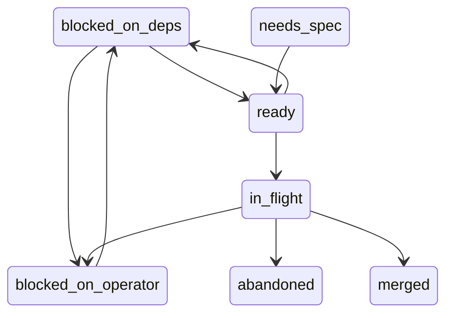
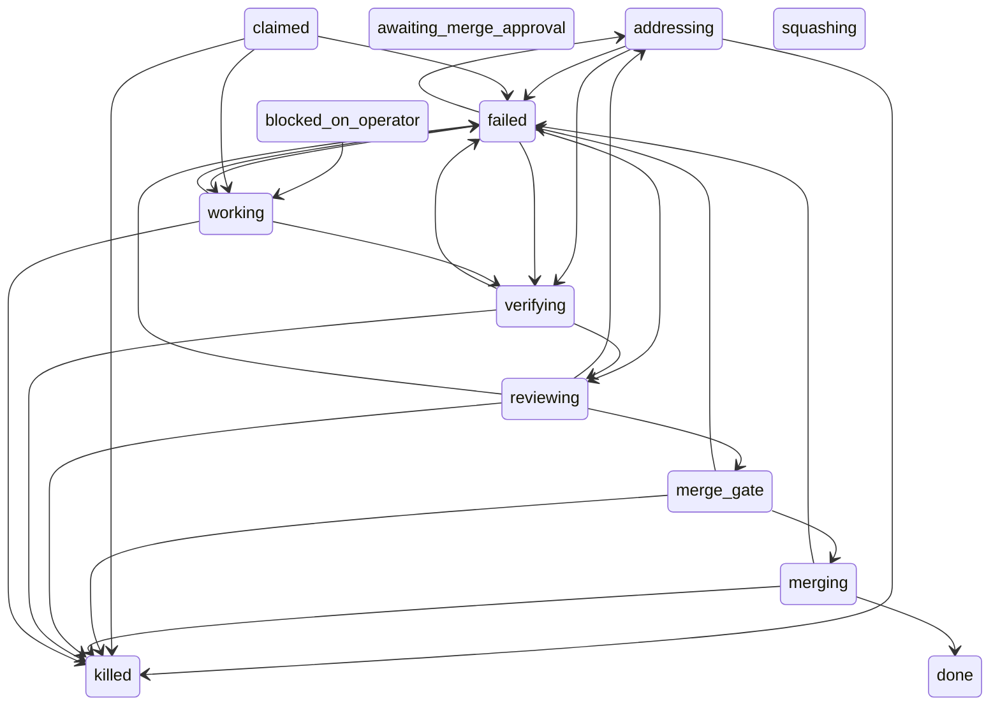

# The loop

What one run of the factory does, and the ticket-status and run-phase state
machines it walks. Back to the [README](../README.md).

## The loop

1. Claim the first ready ticket — non-terminal and unblocked (Linear
   `blocks` relations are the only machine-checked dependencies).
2. Cut a per-task branch in a sibling worktree (`<repo>.worktrees/`), so
   the main checkout stays untouched, and run the target's configured
   `[worktree] setup` commands there — a worktree that borrows the main
   checkout's environment tests something other than the branch it is on.
3. Implementer agent (Claude Code / Opus at high effort, write access)
   implements and commits under a wall-clock budget from the ticket's estimate
   (default 20 min).
4. Verify gate: the ticket's mechanical verify command must pass before
   each review round and again before merge. A failure is fail-loud: a
   top-level `&&` chain is run clause by clause in one shell, and the report
   names the clause that failed and its exit status, shows the output of
   every clause that ran, and names the clauses the failure short-circuited
   — silence is reported as silence, never as a bare non-zero exit.
5. Local reviewer agent (Codex / GPT-5.6 Sol at medium effort) reviews the
   diff against the task inside the hardened container boundary described in
   [Reviewing](reviewing.md);
   findings go back to the implementer for one fix round. Max 2 review
   rounds.
6. Merge gate: the verify command passes again, and the ticket is re-read
   from Linear and held against the snapshot the claim froze (title,
   acceptance criteria, verify commands). A body edited while the run was
   working refuses the merge and preserves the branch — the candidate answers
   the ticket as it was claimed, not as it now reads. A ticket that cannot be
   re-read (Linear down, issue gone) is *not* read as drift: the run records
   that the check had no evidence and the merge goes ahead on the frozen
   contract. On a clean gate: `--no-ff` merge to `main`, worktree and branch
   cleaned up, ticket → Done.
7. On failure (budget blown, no commits, verify stuck, 2 failed rounds):
   the loop stops and leaves the branch + worktree behind for a human;
   the ticket stays In Progress. A no-commit task is discarded outright —
   there is nothing to preserve.
8. On the *second* failed run of the same ticket (`MAX_FAILED_RUNS`), the
   ticket is blocked instead of left open: its stored status becomes
   `blocked_on_operator` and one Linear comment lists what each failed run
   ended on. The claim path re-reads that count before every claim, so the
   ticket is refused even when the board has been dragged back to Todo —
   unblocking is a human's move, not the loop's. Failures are counted since
   the last *recorded* human intervention on the ticket's runs
   (`store.record_intervention()` / `store.resume()`): a recorded human
   touch buys a fresh `MAX_FAILED_RUNS`, while a bare board drag records
   nothing and forgives nothing. A refused ticket is skipped and the next
   one is claimed: a blocked ticket still projects to Todo and still sorts
   where it sorts, so stopping on it would starve every ticket behind it.

## State machines

Both diagrams below are generated from the code, not drawn:
`store/__init__.py`'s `TICKET_TRANSITIONS` and `RUN_PHASE_TRANSITIONS` are the only authority for
which moves are legal, `store.render_state_graph()` renders them, and
`tests/test_store_status_graph.py` fails whenever the text between the
markers differs from what the tables render to. Regenerate with
`python3 store/__init__.py --state-graph` and paste the output over the
marked sections.

Ticket status (`store.transition()` refuses every edge not drawn here):

<!-- state-graph: tickets -->

<!-- end state-graph: tickets -->
Run phase (the edges the loop writes; `awaiting_merge_approval` and
`squashing` are declared but never entered by this loop):

<!-- state-graph: runs -->

<!-- end state-graph: runs -->

