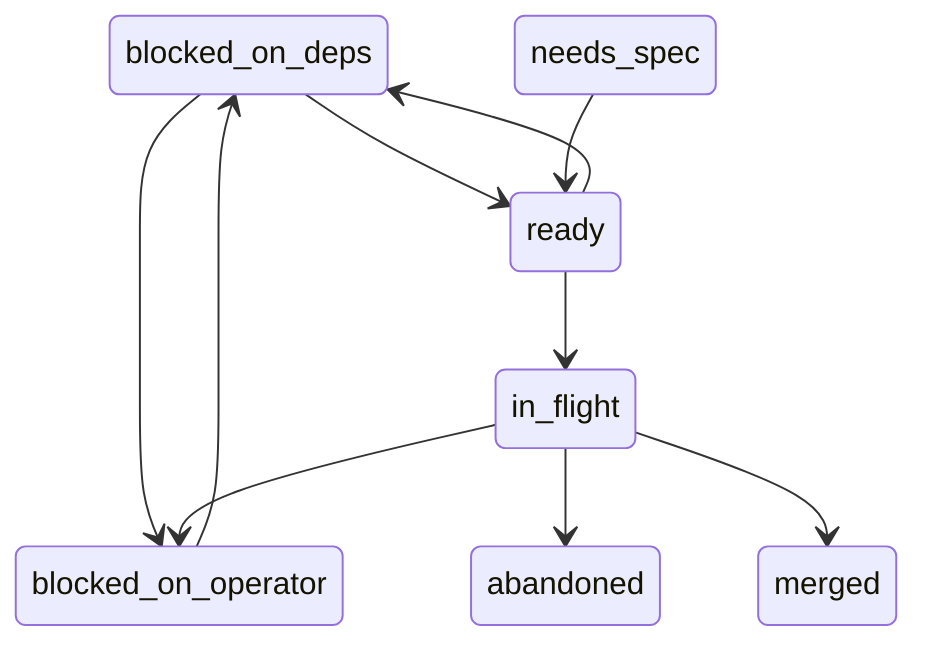
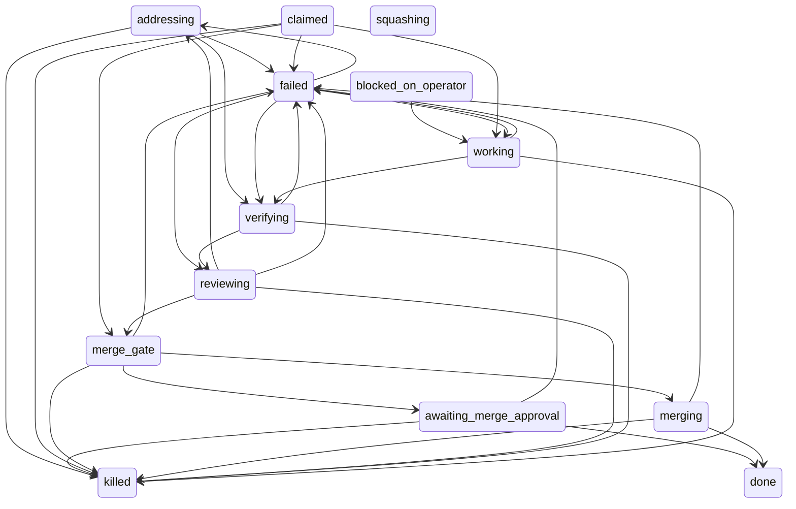

# The loop

What one run of the factory does, and the ticket-status and run-phase state
machines it walks. Back to the [README](index.md).

## The loop

1. Claim the first ready ticket — non-terminal and unblocked (Linear
   `blocks` relations are the only machine-checked dependencies). The lease
   is per ticket, not per project: the claim asserts that the ticket has no
   active run and points its `activeRunId` at the new one, so two loops on
   one target each work a ticket of their own, and a ticket another live
   run holds is skipped in one line (`ticket KO-n: lease already held by
   run N`) for the next candidate rather than stopping the loop. The store
   lease is one writer's: a second writer host has a store of its own and
   cannot see it, so the claim leases the ticket on the board too. Once the
   store lease is taken the issue gets the label `holo:HOST`, where `HOST`
   is this writer's `[report] host_label` (its hostname without one) --
   `holo:writer-1` -- and the team label is created on first use. The
   order is fixed: the store lease first, since it is the atomic one; then
   the label; then the issue's labels read back, because Linear has no
   compare-and-swap and the write is additive (`addedLabelIds`, never the
   whole label list). A ready issue carrying another writer's `holo:`
   label is skipped at admission in one line (`KO-n is leased by HOST on
   the board; skipping it`) and nothing is leased in the store; another
   writer's label the read-back shows instead, taken between the listing
   and the write, backs the claim off the same way: this writer's own
   label comes off, the store lease goes back as an `infra` failure, no
   strike, and the loop takes the next ticket with the same skip line. A
   ready issue carrying this writer's own label with no live run under it
   in this store (a run that ended with the board down) is a stale lease a
   close-out never took off: the claim goes ahead, the stale label is
   removed and the fresh one written, both only once this loop's store
   lease is held, so two loops admitting the same stale label cannot strip
   the one the faster of them has just written. Each close-out -- a merge,
   a failure, a park for a human, a sweep -- and `--requeue` take the
   label off, and only while the store names no other live run on the
   ticket, so a close-out that runs late cannot strip the label a fresh
   claim has since re-asserted. That look and the removal, like the
   claim's lease and label write, run under one per-store turn (a flock
   beside the store), so a claim of this store cannot land between them
   and have its fresh label stripped. A label the board will not take, or
   a read-back it will not answer, takes the label off once, best-effort
   -- a refusal is not proof the write did not land -- fails the claim as
   an `infra` failure and gives the store lease straight back, so a run
   never starts unlabelled. `--requeue` takes the label off
   before the ticket is claimable again. Before the
   first claim the loop runs one read-only sweep of the store. The sweep's
   contract runs the other way too: a run the supervisor's sweep ends while
   the loop is inside a turn is over, and the heartbeat that keeps the run
   alive notices, whether at a beat mid-turn or at the last check when the
   turn returns -- it kills the turn's process group, the loop prints
   `run N was ended by the supervisor (REASON); stopping this turn`, writes
   nothing more to that run, leaves the worktree and branch as the sweep
   preserved them, and goes on to its next claim. Then the loop asks
   GitHub about each pull request a parked run waits on (below, under
   pull request mode) -- before the mirror, so a ticket the merger also
   moved to Done ships its run rather than being walked `merged` with the
   run left parked -- and then reconciles its mirror: every open mirrored
   ticket without an active run
   that Linear now holds completed or canceled (archived issues included;
   an archived issue still in an open state counts as canceled) is walked
   to `merged` or `abandoned`, with a `reconcile` intervention row on its
   most recent run and one printed line naming the move; a board that
   cannot be asked skips the reconcile in one line and the loop goes on.
2. Cut a per-task branch in a sibling worktree (`<repo>.worktrees/`), so
   the main checkout stays untouched, and run the target's configured
   `[worktree] setup` commands there — a worktree that borrows the main
   checkout's environment tests something other than the branch it is on.
3. Implementer agent (Claude Code / Opus at high effort, write access)
   implements and commits under a wall-clock budget from the ticket's estimate
   (default 20 min).
4. Verify gate: the ticket's mechanical verify command must pass before
   each review round and again before merge. A failure is fail-loud: a
   top-level `&&` chain is run clause by clause in one shell, and the report
   names the clause that failed and its exit status, shows the output of
   every clause that ran, and names the clauses the failure short-circuited
   — silence is reported as silence, never as a bare non-zero exit.
5. Local reviewer agent (Codex / GPT-5.6 Sol at medium effort) reviews the
   diff against the task inside the hardened container boundary described in
   [Reviewing](reviewing.md);
   findings go back to the implementer for one fix round. The number of
   rounds is capped per run at
   `min(review_rounds_max, review_rounds + changed_lines // review_rounds_per_lines)`
   from `[loop]` (see [Config](config.md)): 2 by default, one more per 800
   changed lines, never above 4.
6. Merge gate: the gate runs under a per-target merge lock (a file in the
   target's state directory naming the run and when it took it), so two runs
   reaching it together take turns and merges into `main` serialise; a gate
   that waits out the bound parks the ticket naming the holder, and
   `--sweep --act` removes a lock whose run has ended (judged and removed
   under the same arbiter a gate takes it under, so a lock a live process
   still holds is left in place and said so, and a fresh lock is never
   displaced). Under the lock, `main`
   is merged into the branch when it has moved past it -- a conflict aborts
   that merge, leaves the branch at its sha and parks the ticket
   `blocked_on_operator` with the conflicting paths in the question -- then
   the verify command passes again on the result, and the ticket is re-read
   from Linear and held against the snapshot the claim froze (title,
   acceptance criteria, verify commands). A body edited while the run was
   working refuses the merge and preserves the branch — the candidate answers
   the ticket as it was claimed, not as it now reads. A ticket that cannot be
   re-read (Linear down, issue gone) is *not* read as drift: the run records
   that the check had no evidence and the merge goes ahead on the frozen
   contract. On a clean gate: `--no-ff` merge to `main`, worktree and branch
   cleaned up, ticket → Done. Under `[merge] approve = "human"` (see
   [Config](config.md)) the clean gate parks instead of merging: the run
   enters `awaiting_merge_approval`, the ticket goes `blocked_on_operator`
   asking `merge?`, the ledger names the branch and candidate sha, the
   branch and worktree are preserved, and the lease is released so the loop
   claims the next ticket. The run stays open in that phase -- no ending, no
   outcome, no heartbeat, and the sweep leaves it alone as it does a run
   blocked on an operator -- so it is neither a failure nor counted as one;
   `main` is untouched until an operator releases the run with
   `--approve KO-n` (see [CLI](reference/cli.md)): that ends the parked run
   with its resume point at the merge gate and returns the ticket to the
   queue, and the next claim reuses the preserved worktree and branch,
   re-runs the pre-merge verify against current `main` and merges --
   `claimed --> merge_gate` below, with no implementer or reviewer turn.
   Under `[merge] mode = "pr"` the clean gate leaves the machine instead of
   landing on `main`: `git push origin BRANCH`, then a pull request against
   `main` titled `KO-n: TITLE` whose body is the ticket body plus the run's
   FINDINGS entry, in that order. A push the remote refuses or a PR create
   that fails is an infra failure -- no strike, branch and worktree
   preserved, no PR recorded. Then the loop babysits the pull request for
   up to `[merge] pr_rounds` passes (see [PR rounds](reviewing.md#pr-rounds)):
   each pass reads the unresolved review threads and the checks, the
   adjudicator verdicts each thread `ADDRESS`, `DECLINE` or `HUMAN`, the
   addressed ones get a fix round, a push and a reply naming the sha and
   are resolved, the declined ones a reply and are left open. A thread
   naming an existing function, helper or constant the diff duplicates is
   a change request, not a preference: `ADDRESS`, the fix being reuse; the
   repository's `AGENTS.md` or `CLAUDE.md` is quoted in the brief as the
   reviewer's standard, and `DECLINE` is for a thread that asks for
   nothing specific or for what the ticket puts out of scope. Every pass is
   a `reviewRounds` row with route `github:LOGIN`. Green checks and no
   open thread merge the PR through its merge API under `approve = "auto"`;
   under `approve = "human"`, a decline, a `HUMAN` thread, red checks or
   the cap park the run as above, with the PR's URL on the run
   (`runs.prUrl`), in the ticket's question (`PR open: URL`, the open
   threads listed) and in the ledger. `--approve KO-n` resumes the run on
   the PR and merges it when green and quiet; `--babysit KO-n` resumes it
   for another round of passes.
   A babysit resume fast-forwards to the remote branch first (KO-379):
   the pass fetches the branch from `origin` and compares it to the local
   branch the way the merge gate compares `main`. A remote ahead by a
   fast-forward moves the worktree and the local branch to its head, with
   a ledger note (`Fast-forwarded BRANCH to SHA from origin (N commit(s)
   pushed by someone else)`) saying why the reviewed delta grew, and the
   pass treats the new commits as a fix round: they are held to the sha
   the last independent judgement covered, so a person's commits on top
   of a candidate are reviewed before anything merges. Branches that
   diverged park the run with a question naming both shas and nothing
   fetched into the worktree; equal branches change nothing and write no
   note. A fetch that cannot resolve leaves the pass judging from the
   local branch as before, where a head it did not push still parks as
   "someone else pushed". A pull request merged on GitHub by a person
   while the run waits is that approval: at startup and at the top of every
   pass -- each serial claim, each scheduler tick, the timer's included --
   the loop reads each parked pull request's state once, and one merged on
   GitHub closes its run out as merged with the merge commit's sha
   (`awaiting_merge_approval --> done` below), records who merged it in the
   ledger, walks the ticket to `merged` (Done on the board), removes the
   local worktree and branch, and renders the findings window so the run
   appears in Shipped. One closed on GitHub without merging leaves the run
   parked and makes the ticket's question `PR closed without merge: URL`,
   which the skip line then reads; an open one changes nothing, and a
   GitHub error is one printed line for that ticket and the pass goes on,
   with the run still parked for the next pass to ask again. The startup
   mirror reconcile leaves a ticket parked on a pull request alone even
   when the board already says Done, since only GitHub's answer closes the
   run out with its merge commit.
   The same per-tick read also carries the pull request's `updatedAt`,
   its review-thread count and the token's remaining GraphQL budget
   (KO-362). Every park records what the pull request looked like *after*
   the pass's own pushes and replies (`runs.prSeenAt`,
   `runs.prSeenThreads`), and an open pull request whose `updatedAt` has
   moved past that mark, or whose thread count has grown, is a reviewer's
   comment nobody has answered: the tick sends the run back to the
   babysitter exactly as `--babysit KO-n` does -- the intervention row
   `store.babysit()` writes, with source `supervisor`, the run ended with its resume point at the
   merge gate, the ticket `ready` -- and the next claim (the same pass, in
   the serial loop) resumes the candidate on its pull request for another
   round of passes. At most one such round per `[merge] pr_poll_sec`
   (default 180 seconds) per pull request, measured from the park:
   activity inside the interval is named in one line and waits for the
   next tick. A run with no mark (parked by an older build, or after a
   read that failed) has the mark recorded on the first tick and is not
   sent back for it. When the read reports fewer than 500 GraphQL points
   remaining, the tick reads no further pull request and prints one line
   naming the reset time; reads resume once it has passed.
   The factory still never pushes `main`, and never moves the local one
   under this mode: the merge is GitHub's.
7. On failure (budget blown, no commits, verify stuck, 2 failed rounds):
   the loop stops and leaves the branch + worktree behind for a human;
   the ticket stays In Progress. A no-commit task is discarded outright —
   there is nothing to preserve.
8. On the *second* failed run of the same ticket (`MAX_FAILED_RUNS`), the
   ticket is blocked instead of left open: its stored status becomes
   `blocked_on_operator` and one Linear comment lists what each failed run
   ended on. The claim path re-reads that count before every claim, so the
   ticket is refused even when the board has been dragged back to Todo —
   unblocking is a human's move, not the loop's. Failures are counted since
   the last *recorded* human intervention on the ticket's runs
   (`store.record_intervention()` / `store.resume()`): a recorded human
   touch buys a fresh `MAX_FAILED_RUNS`, while a bare board drag records
   nothing and forgives nothing. A refused ticket is skipped and the next
   one is claimed: a blocked ticket still projects to Todo and still sorts
   where it sorts, so stopping on it would starve every ticket behind it.

### The pool

Under `[loop] workers = N` with `N > 1` (see [Config](config.md)) the
process that ran `factory.py TARGET` works no ticket itself: it is the
scheduler of a pool. It runs the startup checks, the read-only sweep, the
reconcile and the supervisor spawn once, for the whole pool, then ticks:
mirror the board's ready listing, count the tickets a worker could claim
(the store's own pickability: mirrored `ready`, under no live run's lease,
every dependency merged -- one listing and one store read per tick, then
the predicate per listed ticket), spawn `factory.py TARGET --worker`
children until `min(claimable, workers)` are alive, block until any child
exits, read its status, repeat. While fewer than `workers` are alive the
block carries `[loop] tick_sec` (default 120 seconds) as a deadline: a
deadline that reaps nobody is a tick like any other, the listing and the
count run again, and a ticket filed while the pool was busy is spawned for
within a tick rather than at the next exit. The timer tick prints nothing
unless it spawns. With the pool full the scheduler waits on exits alone,
since no count could change what it does. A listing the board could not answer is
not an empty queue: nothing is spawned on it, a live pool recounts at its
next exit, and an empty pool ends the loop nonzero rather than reporting a
queue it never saw. A queue of one ticket is one worker, as with `workers =
1`; a queue of five under `workers = 3` is three, and the fourth starts when
one of the three exits. Each worker is step 1 through 7 above for one
ticket -- claim, worktree, implementer, verify, review, merge gate -- and
exits with the run's status: `0` merged, `1` failed, `2` parked awaiting
merge approval, `3` nothing left to claim, `4` stopped for a human. The
children share the scheduler's stdout, so one `tee` captures the pool, and
each worker prints `[holo2 wN]` in place of `[holo2]`, `N` its slot. Merges
into `main` take turns under the merge lock of step 6, and so does a
worker's close-out -- the `FINDINGS.md` regeneration under `[report]
findings = "repo"`, and its commit when the run merged -- so no worker
writes the checkout while a sibling merges
in it, whether the worker's own run merged or failed. `stop_on_failure =
true` stops the spawning at the first failed worker and waits for the
running ones; the scheduler exits nonzero, as the serial loop does. With
the listing empty and no child alive it exits `0`, as the serial loop does
on an empty board. A worker that merged a change to the factory itself
stops the spawning too: the workers already running finish on the code they
started with, and the scheduler re-execs itself once the last one is in,
so no worker ever runs code newer than its scheduler. The supervisor is
spawned by the scheduler, never by a worker.

## State machines

Both diagrams below are generated from the code, not drawn:
`store/__init__.py`'s `TICKET_TRANSITIONS` and `RUN_PHASE_TRANSITIONS` are the only authority for
which moves are legal, `store.render_state_graph()` renders them, and
`tests/test_store_status_graph.py` fails whenever the text between the
markers differs from what the tables render to. Regenerate with
`python3 store/__init__.py --state-graph` and paste the output over the
marked sections.

Ticket status (`store.transition()` refuses every edge not drawn here):

<!-- state-graph: tickets -->

<!-- end state-graph: tickets -->
Run phase (the edges the loop writes; `squashing` is declared but never
entered by this loop, and `awaiting_merge_approval` is entered only under
`[merge] approve = "human"`):

<!-- state-graph: runs -->

<!-- end state-graph: runs -->

