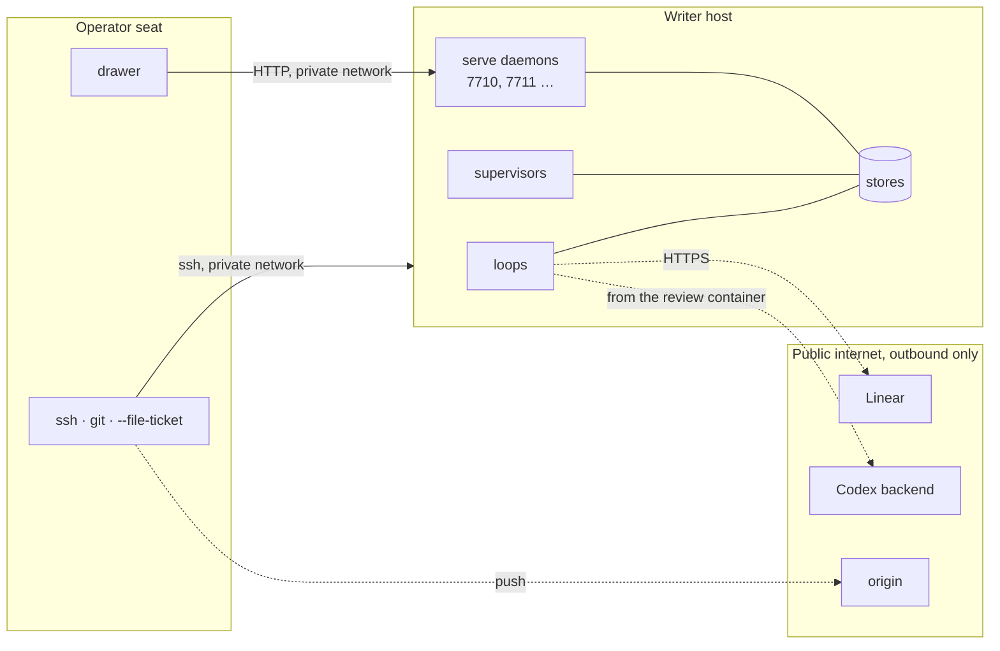

# Across machines

You do not need this page for one machine. Run the loop, the supervisor,
the serve daemon and the drawer on one host, bind the daemon to
`127.0.0.1`, and everything on this site reads as written. This page is
for the day the pieces are split across two machines: it names the two
roles, the private network between them, and the port convention.

Two roles, one private network. The **writer host** runs the loops, the
supervisors and the serve daemons for its targets and holds their stores.
The **operator seat** is where tickets are written and filed, `main` is
pushed from, and the drawer lives. They talk over a private network (a
Tailscale tailnet, a VPN, a LAN you trust) and nothing else. The code
never references that network; it appears only in the address given to
`--serve`, in the URLs in the drawer's config, and in a daemon's
`[console] daemons` list.



## What listens where

| Surface | Bound to | Reachable by | Authentication |
| --- | --- | --- | --- |
| serve daemons | the host's private-network address, one port per target from 7710 | every member of that network | a bearer token per target (`[serve] token_file`); `/`, its files and `/peers` open |
| ssh | the host | the private network (and whatever else the host allows) | keys |
| loop, supervisor, stores | local processes and files | the host only | filesystem |
| Linear, Codex, origin | outbound only | n/a | API key, Codex login, deploy key |

A daemon bound beyond loopback refuses to start without `[serve]
token_file`, and once up answers 401 to every JSON request but `/peers`
that does not carry the file's contents as `Authorization: Bearer`. Write
one token per target on the writer host, owner-readable only:

```sh
umask 077 && head -c 32 /dev/urandom | base64 > ~/.holophyte/SLUG/serve.token
```

and name it in the target's config (`[serve] token_file = "PATH"`) before
restarting the unit; a unit restarted without it fails to start by design.
Still bind the private network's address rather than the wildcard: the
token is the second boundary, not a reason to drop the first.

## Standing daemons

`deploy/holophyte-serve@.service` is a systemd user unit template, one
instance per target slug, reading `~/.holophyte/SLUG/serve.env` for the
target path, the bind address and the port. On the writer host the bind
address is its private-network address rather than `127.0.0.1`. Enable
lingering once per host so the user manager starts at boot; then
`systemctl --user enable --now holophyte-serve@SLUG`. The unit restarts on
failure and is restarted by hand after a merge that touches the daemon's
code. Details in [Serving standing](../operating.md#serving-standing).

## The drawer

`contrib/swiftbar/holophyte.10s.py` runs under SwiftBar on the operator
seat, a Mac. Its config, `~/.holophyte/drawer.toml`, names one daemon per
target; `HOST` is the writer host's name or address on the private
network, and `token_file` a copy of that target's token on this seat,
read on each poll and sent as `Authorization: Bearer` (a relative path
is taken against the config's directory; a daemon without one is polled
bare, and answers 401 if it wanted one):

```toml
linear = "https://linear.app/your-workspace/project/…"

[[daemon]]
name = "holophyte"
url = "http://HOST:7710"
token_file = "holophyte.token"

[[daemon]]
name = "lotuspod"
url = "http://HOST:7711"
token_file = "lotuspod.token"
```

SwiftBar runs plugins with a bare `PATH`, so the plugin folder holds a
one-line wrapper that calls a Python 3.11+ explicitly. The glyph is the
two-leaf mark as an 18 pt template PDF when idle and a white-on-outline
variant with a green, amber or red dot when something is working, needs
attention, or is unreachable; the variant is one design for both menu-bar
tints, because macOS tints the bar from the wallpaper and no signal says
which.

## The console

The console is the other cross-machine client: a page served by one
daemon at `/`, opened in a browser on the operator seat. It fans out from
there. The daemon it was loaded from answers `GET /peers` with its
`[console] daemons` list (`HOST:PORT` strings, one per other daemon on the
private network) and the page polls every one of them from the browser;
the daemons never talk to each other. `/`, the page's files and `/peers`
are open, so the page can load and learn where its peers are before it
holds a token.

Each daemon beyond loopback then wants its own `[serve] token_file`
contents, and the page asks for one token per daemon: a daemon that
answers 401 shows a token field in its card in the Hosts view. The value
is kept in the browser's local storage, keyed by that daemon's address,
and sent as `Authorization: Bearer` on every JSON request to it; it is
never put in a URL, logged, or rendered outside that field. The card of a
daemon with a stored token carries a **Forget token** button that removes
it, after which the card asks again on the next poll. Config for the
fan-out is in [Configuration](../config.md); the protocol in
[HTTP](../reference/http.md#authentication).

## Adding a writer host

Federation is more nodes: install the factory on another machine of the
private network, give each target there a `[board]` table and a serve unit
on the next free port with its own token file, add a `[[daemon]]`
block per target, token and all, to the drawer's config, and name the new
daemons in `[console] daemons` on the daemon that serves the console. No
hub, no relay, no shared store. Two hosts must never
write the same store; one target is served by exactly one host.

## Where a tailnet could carry more

- MagicDNS names in `drawer.toml` instead of raw addresses.
- An ACL tag on writer hosts limiting the daemon ports to the operator
  seat, so a guest node or a phone cannot read run identifiers without a
  grant.
- `tailscale serve` in front of a daemon the day it gains a write
  endpoint: it terminates TLS and adds identity headers, which is per-user
  auth with no secret in the repository.

None of these are needed today. The board, the reviewer's model and the git
remote stay on the public internet by design; pulling them onto the private
network would make the factory depend on a network to do work it can do
from anywhere with a key.
