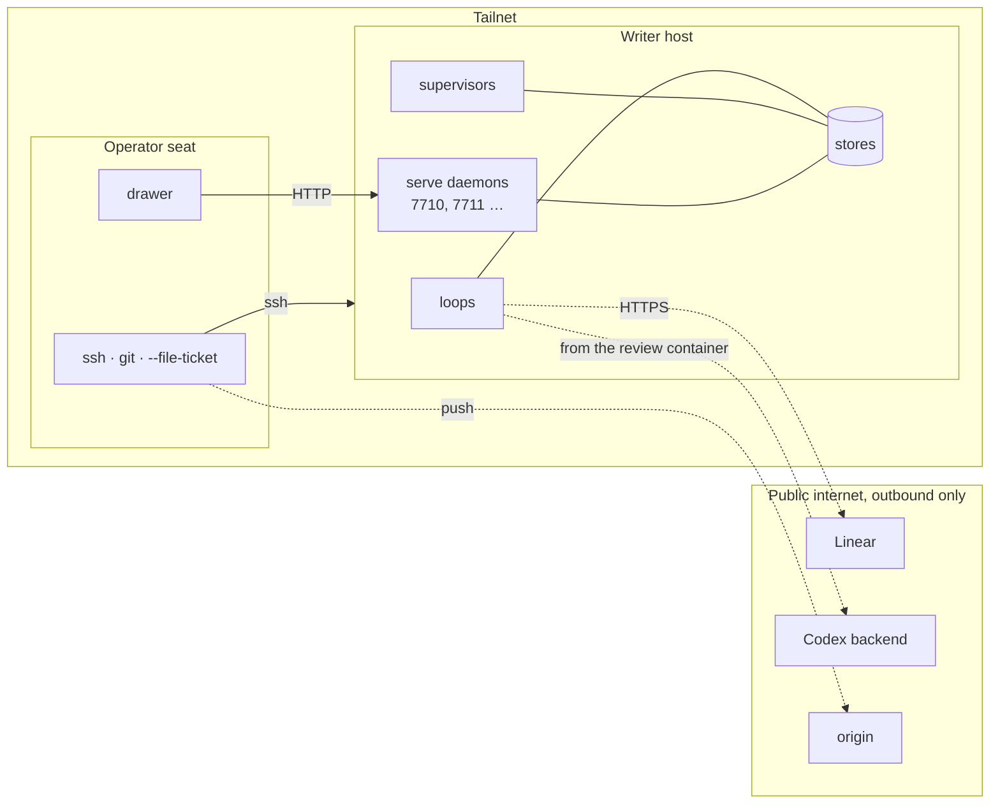

# Hosts and network

Two roles, one private network. The **writer host** runs the loops, the
supervisors and the serve daemons for its targets and holds their stores.
The **operator seat** is where tickets are written and filed, `main` is
pushed from, and the drawer lives. They talk over a Tailscale tailnet and
nothing else.



## What listens where

| Surface | Bound to | Reachable by | Authentication |
| --- | --- | --- | --- |
| serve daemons | the host's tailnet address, one port per target from 7710 | every tailnet member | none; membership is the boundary |
| ssh | the host | the tailnet (and whatever else the host allows) | keys |
| loop, supervisor, stores | local processes and files | the host only | filesystem |
| Linear, Codex, origin | outbound only | n/a | API key, Codex login, deploy key |

The daemon has no authentication on purpose. Bind it to the tailnet
address and never to `0.0.0.0`; there is no flag that narrows an open bind
back. On a personal tailnet that is the whole access control, and it is
documented so nobody adds a token in a hurry later.

## Standing daemons

`deploy/holophyte-serve@.service` is a systemd user unit template, one
instance per target slug, reading `~/.holophyte/SLUG/serve.env` for the
target path, the tailnet address and the port. Enable lingering once per
host so the user manager starts at boot; then `systemctl --user enable
--now holophyte-serve@SLUG`. The unit restarts on failure and is restarted
by hand after a merge that touches the daemon's code. Details in
[Serving standing](../operating.md#serving-standing).

## The drawer

`contrib/swiftbar/holophyte.10s.py` runs under SwiftBar on the operator's
Mac. Its config, `~/.holophyte/drawer.toml`, names one daemon per target:

```toml
linear = "https://linear.app/your-workspace/project/…"

[[daemon]]
name = "holophyte"
url = "http://writer.tailnet:7710"

[[daemon]]
name = "lotuspod"
url = "http://writer.tailnet:7711"
```

SwiftBar runs plugins with a bare `PATH`, so the plugin folder holds a
one-line wrapper that calls a Python 3.11+ explicitly. The glyph is the
two-leaf mark as an 18 pt template PDF when idle and a white-on-outline
variant with a green, amber or red dot when something is working, needs
attention, or is unreachable; the variant is one design for both menu-bar
tints, because macOS tints the bar from the wallpaper and no signal says
which.

## Adding a writer host

Federation is more nodes: install the factory on another tailnet machine,
give each target there a `[board]` table and a serve unit on the next free
port, and add a `[[daemon]]` block per target to the drawer's config. No
hub, no relay, no shared store. Two hosts must never write the same store;
one target is served by exactly one host.

## Where Tailscale could carry more

- MagicDNS names in `drawer.toml` instead of raw addresses.
- An ACL tag on writer hosts limiting the daemon ports to the operator
  seat, so a guest node or a phone cannot read run identifiers without a
  grant.
- `tailscale serve` in front of a daemon the day it gains a write
  endpoint: it terminates TLS and adds identity headers, which is per-user
  auth with no secret in the repository.

None of these are needed today. The board, the reviewer's model and the git
remote stay on the public internet by design; pulling them onto the tailnet
would make the factory depend on a network to do work it can do from
anywhere with a key.
