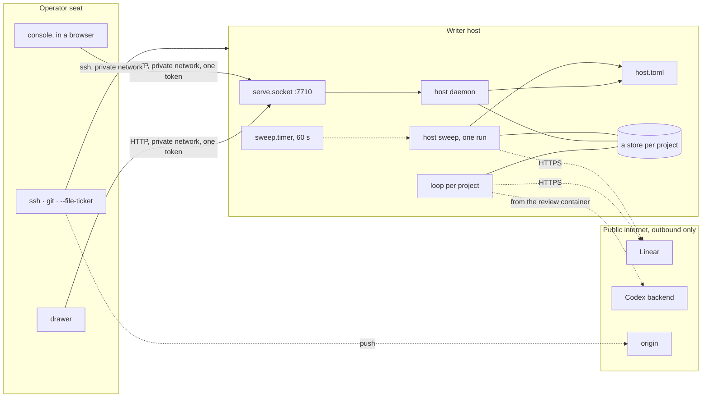

# Across machines

You do not need this page for one machine. Run the loop, the host sweep,
the host daemon and the drawer on one host, bind the daemon to
`127.0.0.1`, and everything on this site reads as written. This page is
for the day the pieces are split across two machines: it names the two
roles, the private network between them, and the port convention.

Two roles, one private network. The **writer host** runs the loops, the
host sweep and one host daemon for all its projects, and holds their
stores, one per project. The **operator seat** is where tickets are
written and filed, `main` is pushed from, and the drawer lives. They talk
over a private network (a Tailscale tailnet, a VPN, a LAN you trust) and
nothing else. The code never references that network; it appears only in
the address the daemon listens on, in the URLs in the drawer's config, and
in `host.toml`'s `[console] daemons` list.



## What listens where

| Surface | Bound to | Reachable by | Authentication |
| --- | --- | --- | --- |
| host daemon | the host's private-network address, port 7710, held by `holophyte-serve.socket` | every member of that network | one bearer token per host, `host.toml`'s `[serve] machine_token_file`; `/`, its files and `/peers` open |
| ssh | the host | the private network (and whatever else the host allows) | keys |
| loops, host sweep, stores | local processes and files | the host only | filesystem |
| Linear, Codex, origin | outbound only | n/a | API key, Codex login, deploy key |

A host daemon listening beyond loopback refuses to start without
`host.toml`'s `[serve] machine_token_file`, and once up answers 401 to
every JSON request but `/peers` that does not carry the file's contents as
`Authorization: Bearer`, at the root and under every `/projects/NAME`
prefix. Write one token per host on the writer host, owner-readable only:

```sh
umask 077 && head -c 32 /dev/urandom | base64 > ~/.holophyte/machine.token
```

and name it in `host.toml` (`[serve] machine_token_file = "machine.token"`,
relative to the home) before the daemon next starts; a daemon started
without it beyond loopback fails by design. A project's own `[serve]
token_file` is still accepted under that project's prefix alone, for one
release. Still bind the private network's address rather than the
wildcard: the token is the second boundary, not a reason to drop the
first.

## Standing daemons

On the writer host the host units stand for every registered project:
`holophyte.target`, which wants `holophyte-serve.socket` (the port,
`ListenStream`, which on this host is the private-network address and
7710 rather than `127.0.0.1:7710`, and `host.toml`'s `[serve] bind` to
match; a tailnet address may come up after the user manager does, so give
the socket `FreeBind=true` there), and `holophyte-sweep.timer`, which runs
the oneshot
`holophyte-sweep.service` every 60 s. The socket starts
`holophyte-serve.service`, the host daemon, on the first connection. Enable
lingering once per host so the user manager starts at boot; then
`systemctl --user enable --now holophyte.target`. Nothing is restarted by
hand after a merge: the daemon exits on a factory `HEAD` move and the
socket starts the new code on the next request, and every sweep run starts
from the checkout's `HEAD`. Details in
[Serving standing](../operating.md#serving-standing).

The loop stays one per project: `holophyte-loop@NAME`, one pass of the
loop, `Restart=no`, reading `~/.holophyte/NAME/serve.env` for the project
path. The host sweep starts it when the project has a ready ticket and no
loop is live, and it is inactive again once the queue is empty; start it
by hand with `systemctl --user start holophyte-loop@NAME`. A project kept
out of the registry keeps the project units instead: `holophyte-serve@NAME`
on its own port and `holophyte-supervise@NAME`, the supervisor, enabled
with `systemctl --user enable --now holophyte-supervise@NAME`; never for a
registered project, whose supervisor is the host sweep. Units outlive the
shell session that started them, so a dead tmux server takes nothing down
with it.

## The drawer

`contrib/swiftbar/holophyte.10s.py` runs under SwiftBar on the operator
seat, a Mac. Its config, `~/.holophyte/drawer.toml`, names one daemon per
host; `HOST` is the writer host's name or address on the private network,
and `token_file` a copy of that host's machine token on this seat, read on
each poll and sent as `Authorization: Bearer` (a relative path is taken
against the config's directory; a daemon without one is polled bare, and
answers 401 if it wanted one):

```toml
linear = "https://linear.app/your-workspace/project/…"

[[daemon]]
name = "writer"
url = "http://HOST:7710"
token_file = "writer-machine.token"
```

The drawer reads the root `/status` for the registered projects and the
last sweep, then each project under `/projects/NAME`: a block per project,
and above the first a line with the sweep's age. A daemon run for one
project (`[[daemon]]` at that project's port, with its `token_file`) still
works beside it.

SwiftBar runs plugins with a bare `PATH`, so the plugin folder holds a
one-line wrapper that calls a Python 3.11+ explicitly. The glyph is the
two-leaf mark as an 18 pt template PDF when idle and a white-on-outline
variant with a green, amber or red dot when something is working, needs
attention, or is unreachable; the variant is one design for both menu-bar
tints, because macOS tints the bar from the wallpaper and no signal says
which.

## The console

The console is the other cross-machine client: a page served by one
daemon at `/`, opened in a browser on the operator seat. It fans out from
there. The daemon it was loaded from answers `GET /peers` with its
`[console] daemons` list (`HOST:PORT` strings, one per other host's
daemon on the private network; `host.toml`'s on a host daemon) and the
page polls every one of them from the browser; the daemons never talk to
each other. `/`, the page's files and `/peers` are open, so the page can
load and learn where its peers are before it holds a token.

A host daemon is one card in the Hosts view, listing the last sweep, the
builds and each project's beat, runs and error, and the page asks for one
token per daemon: a daemon that answers 401 shows a token field in its
card. The value is kept in the browser's local storage, keyed by that
daemon's address, and sent as `Authorization: Bearer` on every JSON
request to it, the root and every project prefix alike; it is never put
in a URL, logged, or rendered outside that field. The card of a daemon
with a stored token carries a **Forget token** button that removes it,
after which the card asks again on the next poll. The Electron console
seeds the same token from `console.json`'s `token_files`, keyed
`HOST:7710`. Config for the fan-out is in [Configuration](../config.md);
the protocol in [HTTP](../reference/http.md#authentication).

## Adding a writer host

Federation is more nodes: install the factory on another machine of the
private network, register each project there with `factory.py project add
PATH`, write that host's machine token and `host.toml` keys, enable
`holophyte.target`, add one `[[daemon]]` block for the host, token and
all, to the drawer's config, and name the new daemon in `[console]
daemons` in the `host.toml` of the host that serves the console. No hub,
no relay, no shared store. Two hosts must never write the same store; one
project is registered on exactly one host.

## Where a tailnet could carry more

- MagicDNS names in `drawer.toml` instead of raw addresses.
- An ACL tag on writer hosts limiting the daemon ports to the operator
  seat, so a guest node or a phone cannot read run identifiers without a
  grant.
- `tailscale serve` in front of a daemon the day it gains a write
  endpoint: it terminates TLS and adds identity headers, which is per-user
  auth with no secret in the repository.

None of these are needed today. The board, the reviewer's model and the git
remote stay on the public internet by design; pulling them onto the private
network would make the factory depend on a network to do work it can do
from anywhere with a key.
